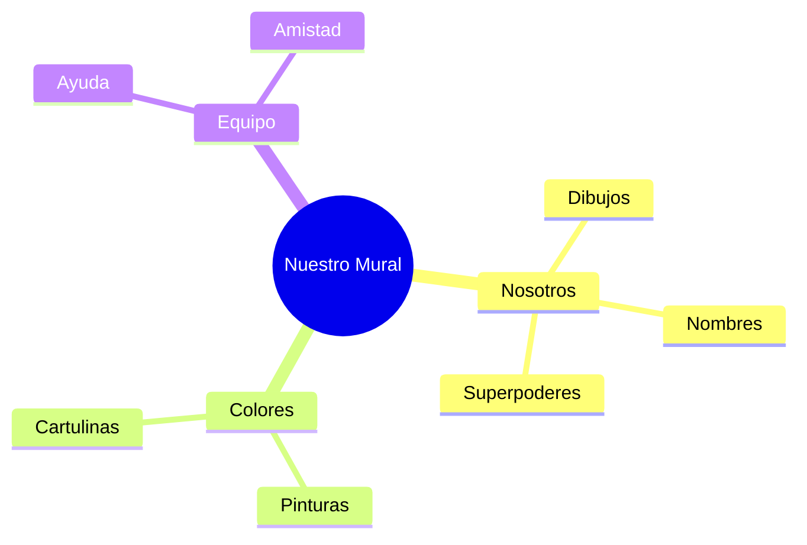

¡Enhorabuena! Has completado tus primeras misiones de 2º. Ahora vamos a hacer algo **especial** entre todos.

## Situación de Aprendizaje: El Mural de los Sueños

Para que nuestra clase sea única, vamos a crear un gran mural donde aparezcamos todos.

### ¿Qué necesitamos?
*   Cartulina grande de colores.
*   Rotuladores, ceras y lápices de colores.
*   Pegamento y tijeras (¡cuidado con la punta!).
*   Mucha imaginación.

### Instrucciones paso a paso

1.  **Dibuja tu autoretrato**: En un trozo de papel, dibújate a ti mismo con tu ropa favorita y una gran sonrisa.
2.  **Escribe tu nombre**: Debajo de tu dibujo, escribe tu nombre con letras muy bonitas y decoradas.
3.  **Tu superpoder**: Al lado de tu nombre, escribe una cosa que se te dé muy bien (ejemplo: "Sé correr muy rápido", "Me gusta cantar", "Soy muy buen compañero").
4.  **¡A pegar!**: Con ayuda del maestro, pegaremos todos los dibujos en la cartulina grande para formar el mural de 2ºB.

:::tip ¡Misión cumplida!
Cuando el mural esté colgado en la pared, ¡nuestra clase estará lista para empezar la aventura!
:::

**¿Cómo te sientes hoy?**
Dibuja una carita al final del mural que explique cómo te has sentido en tu primer día de 2º. ¡Estamos muy orgullosos de ti!
