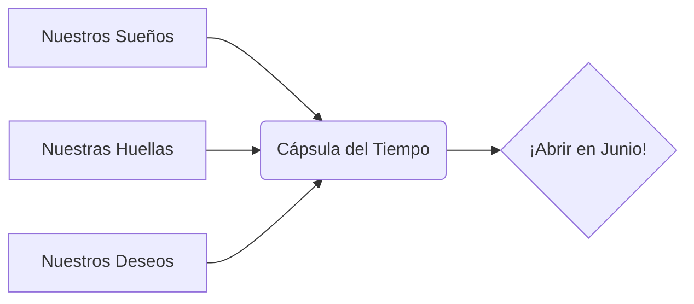

¡Enhorabuena! Has completado tus primeras misiones de 2º. Ahora vamos a hacer algo **mágico** para recordar este curso para siempre.

## Situación de Aprendizaje: La Cápsula del Tiempo

¿Sabes qué es una cápsula del tiempo? Es un recipiente donde guardamos tesoros de hoy para abrirlos en el futuro (¡cuando termine el curso!).

### ¿Qué necesitamos?
*   Una caja de zapatos (la decoraremos entre todos).
*   Hojas de papel y sobres.
*   Cintas, pegatinas y rotuladores de colores.
*   ¡Un deseo secreto!

### Instrucciones para la Misión

1.  **Mi Carta para el Futuro**: Escribe una carta pequeña para ti mismo. Cuéntale qué te gustaría aprender este año (ejemplo: "Quiero aprender a sumar números muy grandes" o "Quiero leer un libro entero").
2.  **Mi Huella**: En un folio, dibuja el contorno de tu mano con un color bonito. ¡Veremos cuánto ha crecido al final del curso!
3.  **El Objeto Especial**: Dibuja en un papelito algo que te guste mucho hoy (tu juguete favorito, tu comida preferida o tu color del momento).
4.  **Ceremonia de Cierre**: Meteremos todos los sobres en nuestra caja, la cerraremos con cinta de colores y el maestro la guardará en un sitio muy alto del aula.

## Compromiso de Equipo

Para que esta cápsula se llene de magia, todos prometemos:
*   **Respetar** a los compañeros.
*   **Esforzarnos** cada día un poquito más.
*   **Cuidar** nuestro material y nuestra clase.

:::tip ¡Misión cumplida!
Cuando la caja esté cerrada, ¡nuestra aventura de 2º habrá comenzado oficialmente! Ya somos un equipo unido.
:::

**¿Cómo te sientes al empezar este viaje?**
Escribe una palabra que resuma tu emoción hoy: **¡ALEGRÍA, NERVIOS, ILUSIÓN!**

