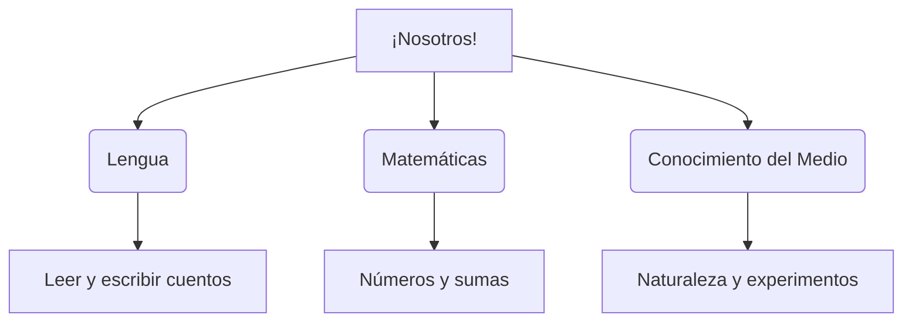

¡Hola! Qué alegría volver a vernos. Este año va a ser **increíble**. En nuestra clase de **2º de Primaria** vamos a descubrir un montón de cosas nuevas.

## Nuestra Clase es un Equipo

En el cole, todos somos amigos y nos ayudamos. Para que nuestra clase sea el mejor sitio del mundo, tenemos que recordar algunas cosas:

*   **Saludamos** al llegar con una gran sonrisa.
*   **Escuchamos** cuando alguien habla.
*   **Compartimos** nuestros materiales.
*   **Recogemos** todo al terminar.

:::info ¿Sabías que...?
Nuestra clase es como una pequeña familia donde todos aprendemos juntos.
:::

## ¿Cómo nos organizamos?

Mira este esquema para ver cómo vamos a trabajar este curso:

## Nuestros Rincones Mágicos

En el aula tenemos diferentes sitios especiales:

1.  **La Biblioteca**: Para leer aventuras fantásticas.
2.  **El Rincón de Mates**: Con juegos para contar y medir.
3.  **El Perchero**: Para dejar nuestras mochilas bien ordenadas.

:::tip Truco
Si mantienes tu mesa limpia y ordenada, ¡encontrarás tus lápices mucho más rápido!
:::
