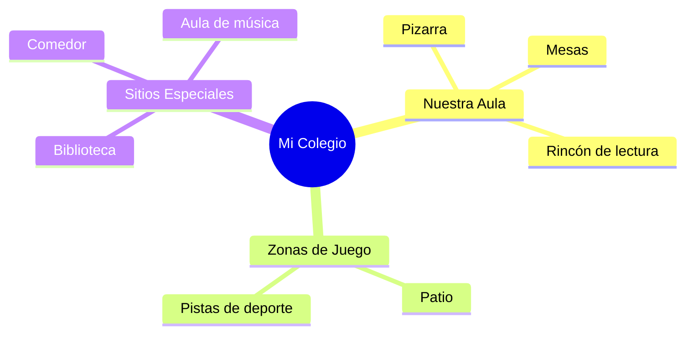

¡Hola! Qué alegría volver a vernos. Este año va a ser **increíble**. En nuestra clase de **2º de Primaria** vamos a descubrir un montón de cosas nuevas y a conocer mejor nuestro colegio.

## El Colegio: Mi Segundo Hogar

Nuestro colegio no es solo un edificio, es un lugar lleno de personas que nos ayudan a crecer. ¿Sabes quiénes forman nuestro equipo?

*   **Tus compañeros y compañeras**: Con los que juegas y aprendes cada día.
*   **Tus maestros**: Que te enseñan cosas fascinantes.
*   **Conserjes y personal de limpieza**: Que cuidan que todo esté perfecto.

## Los Espacios de Mi Cole

¿Te has fijado en cuántos sitios diferentes tiene nuestro colegio? Mira este mapa de ideas:

## Nuestra Clase es un Equipo

Para que nuestra clase sea el mejor sitio del mundo, tenemos que recordar algunas normas de convivencia:

*   **Saludamos** al llegar con una gran sonrisa.
*   **Escuchamos** con atención cuando alguien habla.
*   **Pedimos las cosas "por favor"** y damos las "gracias".
*   **Recogemos** nuestros materiales al terminar.

:::info ¿Sabías que...?
En Extremadura, muchos colegios tienen nombres de personas importantes de nuestra historia o de la naturaleza que nos rodea. ¿Cómo se llama el tuyo?
:::

## Nuestros Rincones Mágicos

En el aula tenemos diferentes sitios especiales donde ocurre la magia:

1.  **La Biblioteca**: Un rincón tranquilo para viajar con la imaginación.
2.  **El Rincón de Mates**: Donde los números se convierten en divertidos juegos.
3.  **El Mural de los Cumpleaños**: Para celebrar que todos crecemos juntos.

:::tip Truco
Si mantienes tu mesa limpia y ordenada, ¡encontrarás tus colores mucho más rápido y trabajarás más feliz!
:::
