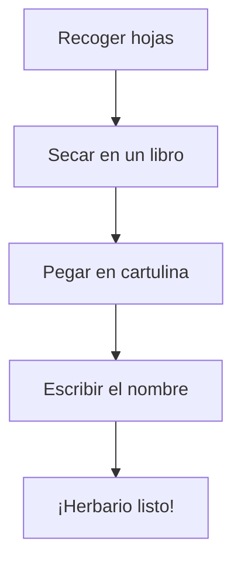

¡Ya eres un experto en el otoño! Ahora vamos a convertirnos en **botánicos** y a crear algo precioso con nuestras manos.

## Situación de Aprendizaje: El Herbario de Clase

Un herbario es como un álbum de fotos, pero en lugar de fotos, ¡pegamos hojas de verdad!

### ¿Qué necesitamos?
*   Hojas secas de diferentes formas y colores (puedes recogerlas en el parque o en el patio).
*   Folios o cartulinas blancas.
*   Cinta adhesiva o pegamento.
*   Un libro gordo para prensar las hojas.

### Instrucciones paso a paso

1.  **Recogida**: Busca hojas que se hayan caído al suelo. ¡No las arranques del árbol!
2.  **Prensado**: Pon las hojas dentro de un libro gordo durante unos días para que se queden bien planitas.
3.  **Montaje**: Pega cada hoja en un folio limpio.
4.  **Etiquetado**: Escribe debajo de qué árbol es la hoja (si no lo sabes, ¡pregunta al maestro o busca en un libro!).
5.  **Descripción**: Escribe de qué color es y si es suave o rugosa.

:::tip ¡Misión cumplida!
Cuando tengamos todas las hojas, las encuadernaremos y tendremos el primer **Gran Libro de la Naturaleza** de nuestra clase.
:::

**Pregunta final:**
¿Cuál es tu color favorito del otoño? Dibújalo en una esquina de tu herbario para decorarlo. ¡Buen trabajo!
