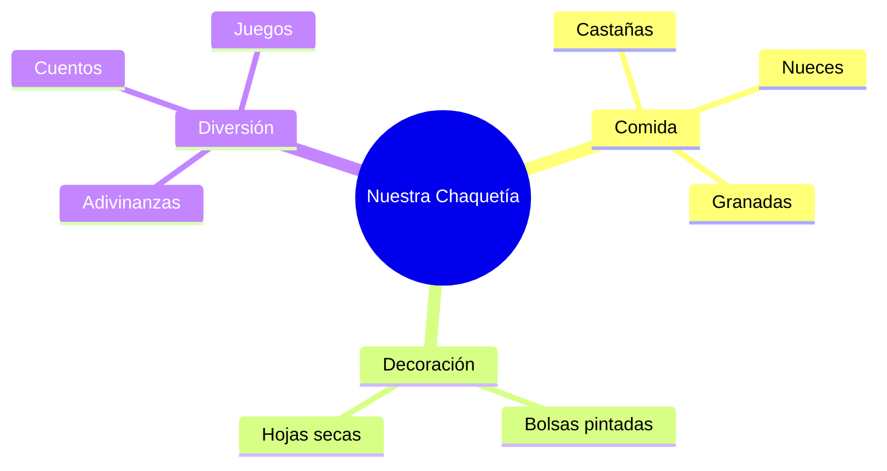

¡Ya eres un experto en el otoño! Ahora vamos a celebrar una de las tradiciones más bonitas de Extremadura: **¡La Chaquetía!**

## Situación de Aprendizaje: Organizamos nuestra Chaquetía

En los pueblos de Extremadura, el día 1 de noviembre nos vamos al campo con una bolsa llena de castañas, nueces y granadas. ¡Vamos a preparar la nuestra en clase!

### ¿Qué necesitamos preparar?
*   **Nuestro "Cucurucho"**: Una bolsa de papel decorada por nosotros.
*   **Frutos del Otoño**: Castañas, bellotas, nueces o cualquier fruto seco que te guste.
*   **Un Herbario de Recuerdos**: Una hoja especial que hayamos encontrado.
*   **¡Ganas de compartir!**

### Instrucciones para el Evento

1.  **El Diseño del Cucurucho**: Decora una bolsa de papel con dibujos de hojas, setas y ardillas. Escribe tu nombre bien grande.
2.  **El Tesoro Botánico**: Elige la hoja más bonita que hayas encontrado en el patio o el parque. Pégala en una cartulina y escribe: *"Esta es mi hoja de otoño"*.
3.  **Cuento en Círculo**: Nos sentaremos todos en círculo y cada uno contará cuál es su fruto favorito y por qué.
4.  **Adivinanzas de Otoño**: El maestro dirá adivinanzas y el que la acierte podrá poner una pegatina en su cucurucho.

## El Rincón de la Naturaleza

Con todas nuestras hojas pegadas y nuestros cucuruchos, montaremos un **Rincón del Otoño** en clase. Será nuestro pequeño trozo de dehesa dentro del aula.

:::tip ¡Misión cumplida!
Cuando el rincón esté listo, ¡celebraremos nuestra fiesta compartiendo los frutos secos! Recuerda pedir ayuda para pelar las castañas.
:::

**¿Qué es lo que más te ha gustado del otoño?**
Dibuja una pequeña castaña sonriente si te lo has pasado genial aprendiendo sobre esta estación. ¡Buen trabajo, botánico!

