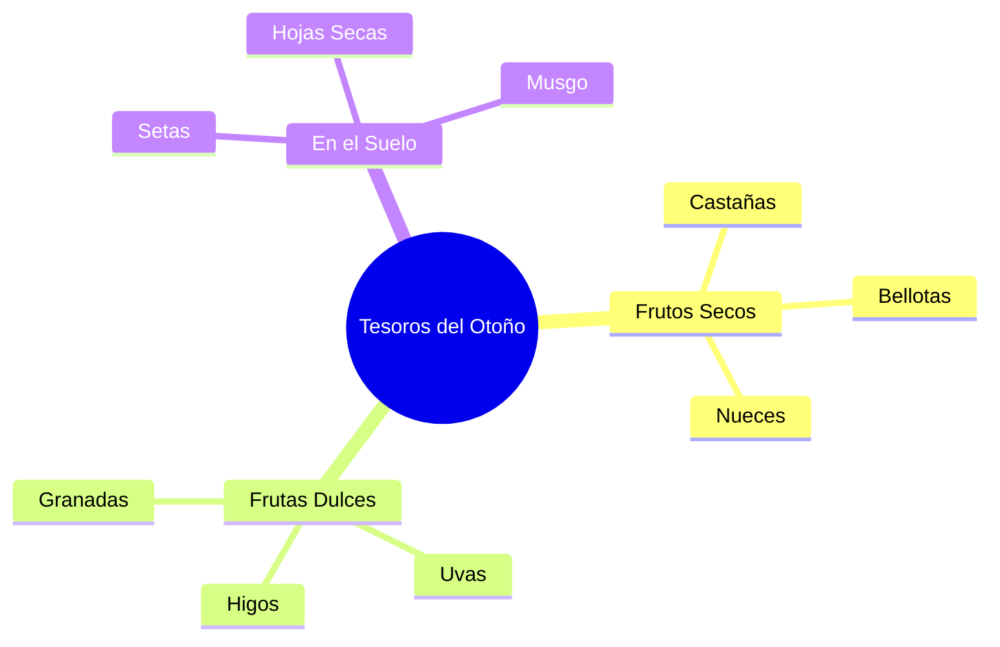

¡El otoño ha llegado a Extremadura! ¿Te has fijado en cómo cambian los árboles de nuestros parques y campos? Nuestra **dehesa** se convierte en un escenario lleno de colores amarillos, naranjas y marrones.

## ¿Qué ocurre en la Naturaleza?

En esta estación, el mundo exterior empieza a prepararse para descansar. Estos son los cambios principales:

*   **Los días se acortan**: El sol se va a dormir antes y las noches son más largas.
*   **El termómetro baja**: Ya no hace tanto calor como en verano. ¡Es hora de buscar la rebeca!
*   **La migración**: Muchas aves, como las cigüeñas, inician viajes largos hacia lugares más cálidos.
*   **El sueño de los árboles**: Algunos árboles (los de **hoja caduca**) dejan caer sus hojas para ahorrar energía.

## Los Tesoros de la Dehesa Extremeña

Nuestra tierra es muy especial en otoño. Mira lo que podemos encontrar:

:::info ¿Sabías que...?
En Extremadura, a las castañas que se asan en el campo el día 1 de noviembre las llamamos **"La Chaquetía"**. ¡Es una tradición muy divertida!
:::

## Animales en Otoño

Los animales también notan el cambio. Las **ardillas** recogen piñones para el invierno y el **ciervo** protagoniza la "berrea" en lugares como el Parque de Monfragüe. ¡Sus bramidos se oyen desde muy lejos!

:::tip Curiosidad
¿Has oído crujir las hojas secas al pisarlas? ¡Es el sonido oficial del otoño! Intenta pisar las que son de color marrón, son las que más ruido hacen.
:::
