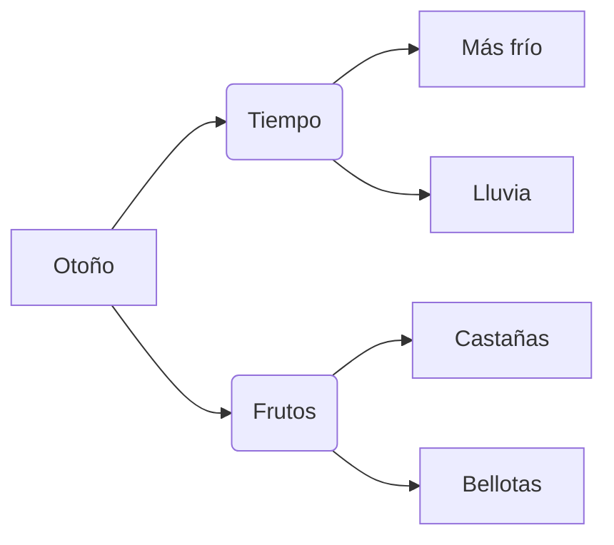

¡El otoño ha llegado a Extremadura! ¿Te has fijado en cómo cambian los árboles? Nuestra **dehesa** se viste de colores amarillos, naranjas y marrones.

## ¿Qué pasa en el otoño?

En esta estación pasan cosas mágicas en la naturaleza:

*   **Los días son más cortos**: Hay menos horas de sol y anochece antes.
*   **Hace más fresquito**: Sacamos las chaquetas y las botas de agua.
*   **Las hojas se caen**: Algunos árboles, como los robles, pierden sus hojas.
*   **Llega la lluvia**: El campo se pone verde y aparecen las primeras setas.

:::info ¿Sabías que...?
En Extremadura tenemos muchos **alcornoques** y **encinas**. Sus frutos se llaman **bellotas** y son el alimento favorito de los cerditos.
:::

## Los Frutos del Otoño

El otoño nos regala cosas muy ricas para comer:

1.  **Castañas**: ¡Qué ricas están asadas!
2.  **Bellotas**: Las hay dulces y amargas.
3.  **Granadas**: Con sus granitos rojos como rubíes.
4.  **Setas**: Pero ¡cuidado!, algunas no se pueden comer.

:::tip Truco
Si ves que las golondrinas se van volando en grupos grandes, ¡es que el frío ya está cerca!
:::
