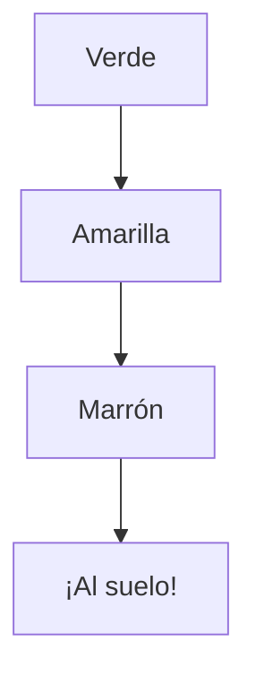

¡Vamos a usar las matemáticas y la lengua para descubrir los secretos del otoño!

## Misión 1: Las Decenas de Bellotas

Imagina que hemos ido de excursión al campo y hemos recogido muchas bellotas. Para no liarnos, las vamos a meter en bolsas de **10 bellotas**.

*   Si tenemos una bolsa llena, tenemos **1 decena (10)**.
*   Si tenemos bellotas sueltas, son las **unidades (1)**.

### ¡Calcula tú!
Observa y completa cuántas bellotas tenemos en total:

1.  **3 bolsas** de diez y **5 bellotas** sueltas $\rightarrow$ ______ bellotas.
2.  **5 bolsas** de diez y **2 bellotas** sueltas $\rightarrow$ ______ bellotas.
3.  **8 bolsas** de diez y **0 bellotas** sueltas $\rightarrow$ ______ bellotas.

:::tip Recuerda
Para saber el número, el primer dígito son las bolsas (decenas) y el segundo las sueltas (unidades).
:::

## Misión 2: Sopa de Letras Otoñal

En otoño usamos palabras especiales. ¿Sabrías escribir estas palabras correctamente? ¡Fíjate en las letras que faltan!

*   **C _ S _ A _ A** (Se asan en el fuego).
*   **B _ L L _ T A** (Fruto de la encina).
*   **L L _ V _ A** (Cae de las nubes).
*   **H _ J A** (Se caen de los árboles).

**Reto de Escritura:** Inventa una historia muy cortita (de dos frases) donde aparezca un **ardilla** y una **castaña**.

## Misión 3: El Ciclo de la Hoja

¿Sabes por qué cambian las hojas? Ordena estos pasos del 1 al 4:

*   [ ] La hoja se vuelve de color marrón.
*   [ ] La hoja está verde y llena de vida en verano.
*   [ ] El viento sopla y la hoja cae al suelo.
*   [ ] La hoja empieza a ponerse amarilla.

:::info Sabiduría Extremeña
En Extremadura decimos que cuando las grullas cruzan el cielo gritando, es que el invierno viene "volando". ¡Fíjate en el cielo estos días!
:::

:::success ¡Objetivo Conseguido!
Has demostrado ser un experto en el otoño y en los números. ¡Sigue así!
:::
