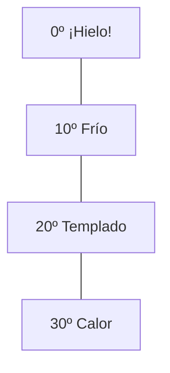

¡Vamos a usar las matemáticas para contar los tesoros del otoño!

## Misión 1: Las Decenas de Bellotas

Imagina que hemos ido de excursión a la dehesa y hemos recogido muchas bellotas. Para no liarnos, las vamos a meter en bolsas de **10 bellotas**.

*   Si tenemos una bolsa llena, tenemos **1 decena**.
*   Si tenemos bellotas sueltas, son las **unidades**.

**¿Cuántas bellotas hay?**
*   2 bolsas de diez y 3 bellotas sueltas: **23 bellotas**.
*   4 bolsas de diez y 7 bellotas sueltas: **____ bellotas**.
*   1 bolsa de diez y 9 bellotas sueltas: **____ bellotas**.

:::tip Recuerda
1 Decena = 10 Unidades.
:::

## Misión 2: Palabras de Otoño

Lee estas palabras y rodéalas con un círculo si las ves en el campo en otoño:

`CASTAÑA - PISCINA - HELADO - LLUVIA - PARAGUAS - BELLOTA - SOL - HOJA`

**¡Tu turno!** Escribe una frase usando dos de estas palabras. 
Ejemplo: *"Me gusta comer castañas cuando hay lluvia"*.

## Misión 3: El Termómetro

En otoño, la temperatura baja. Mira este dibujo de un termómetro y marca dónde crees que está la rayita en un día de mucho frío:

:::info ¿Sabías que...?
En muchos pueblos de Extremadura celebramos la **Calbotá**, donde nos reunimos para asar castañas en el campo. ¡Es divertidísimo!
:::
