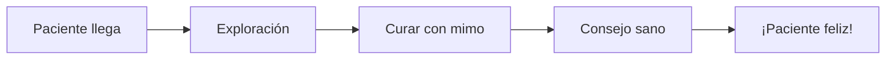

¡Ya sabes muchísimo sobre el cuerpo! Ahora vamos a ponerlo en práctica con un juego muy divertido.

## Situación de Aprendizaje: ¡Abrimos el Hospital de Juguetes!

Hoy nuestra clase se convierte en una clínica para cuidar a nuestros muñecos y peluches favoritos.

### ¿Qué necesitamos?
*   Tu peluche o juguete favorito.
*   Vendas de papel o trozos de tela.
*   Tiritas de colores.
*   Un "carnet de médico" hecho por ti.

### Instrucciones paso a paso

1.  **Recepción**: Ponle un nombre a tu juguete y explica qué le pasa (ejemplo: "Se ha caído de la silla y le duele el brazo").
2.  **Exploración**: Mira si tiene los huesos bien y dónde le duele.
3.  **Cura**: Ponle una tirita o una venda con mucho cuidado.
4.  **Receta de Salud**: Escribe un consejo para que se recupere pronto (ejemplo: "Dormir mucho y comer fruta").

:::tip ¡Misión cumplida!
Cuidar a los demás es tan importante como cuidarnos a nosotros mismos. ¡Eres un gran doctor/a!
:::

**Pregunta final:**
¿Qué es lo que más te gusta hacer para estar activo y feliz? ¡Dibújalo en la parte de atrás de tu carnet de médico!
