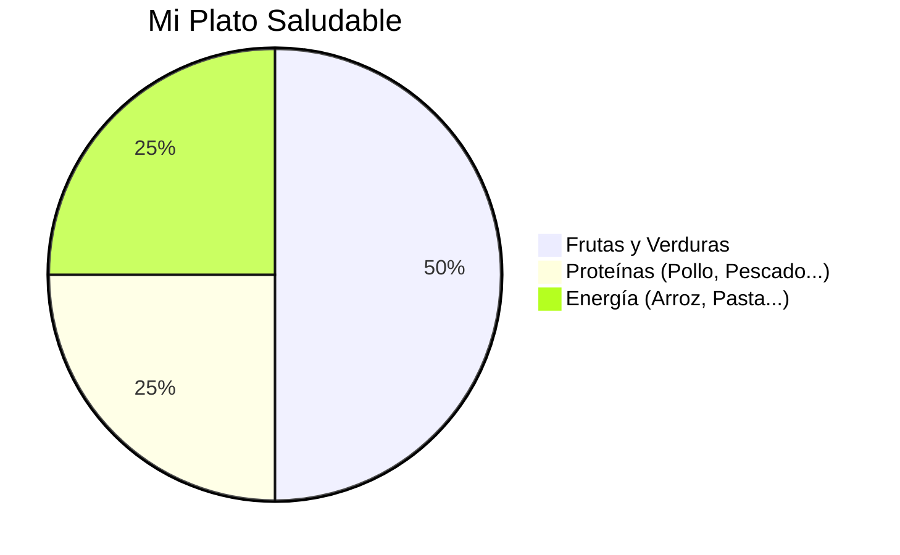

¡Ya sabes muchísimo sobre el cuerpo y la alimentación! Ahora vamos a convertirnos en **Chefs de Súper Salud**.

## Situación de Aprendizaje: El Restaurante del Equipo 2º

Hoy vamos a diseñar un menú que nos dé superpoderes para todo el día. ¡La comida sana también puede ser muy divertida!

### ¿Qué necesitamos?
*   Folios y pinturas de colores.
*   Recortes de revistas de comida (si tienes).
*   ¡Mucha creatividad culinaria!
*   Tu gorro de Chef (puedes hacerlo con papel).

### Instrucciones para la Misión

1.  **Diseña tu Plato Combinado**: Dibuja un círculo grande en un folio (será tu plato). Debe tener tres partes:
    *   La mitad del plato con **verduras y frutas** de colores.
    *   Un cuarto con **proteínas** (carne, pescado, huevos o legumbres).
    *   El otro cuarto con **hidratos** (arroz, pasta o patata).
2.  **Ponle un nombre divertido**: No digas "ensalada", di "El Bosque Mágico de Brócoli". ¡Sé creativo!
3.  **La Bebida de los Campeones**: Dibuja al lado un vaso de lo más sano que existe. ¿Sabes qué es? ¡Exacto, el agua!
4.  **El Postre Natural**: Elige una fruta típica de Extremadura para terminar tu menú (cerezas del Jerte, higos, ciruelas...).

## Presentación al Jurado

Explica a tus compañeros por qué tu plato es bueno para el cuerpo. Puedes decir: *"Mi plato ayuda a los músculos porque tiene pollo y a la vista porque tiene zanahorias"*.

:::tip ¡Misión cumplida!
¡Enhorabuena, Chef! Has demostrado que comer sano es el mejor secreto para crecer fuertes. ¡Reparte pegatinas de frutas a tus compañeros!
:::

**¿Cuál es tu fruta favorita para merendar?**
Dibuja una pequeña manzana roja si prometes intentar comer más fruta esta semana. ¡Buen provecho!

