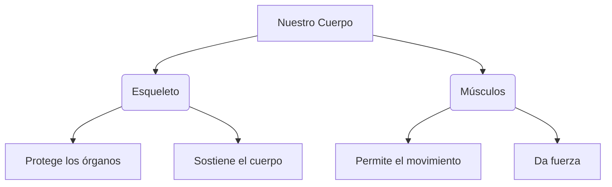

Nuestro cuerpo es como una **máquina perfecta**. ¡Y nosotros somos los encargados de cuidarla!

## ¿Qué hay dentro de nosotros?

Aunque no los veamos, tenemos cosas muy importantes dentro:

*   **Los Huesos**: Son duros y forman el esqueleto. ¡Nos ayudan a estar de pie!
*   **Los Músculos**: Son blandos y elásticos. ¡Nos ayudan a movernos!
*   **Las Articulaciones**: Son las "bisagras" donde se unen los huesos (como los codos o las rodillas).

## Los 5 Sentidos

Gracias a ellos podemos conocer todo lo que nos rodea:

1.  **Vista**: Con nuestros ojos vemos colores y formas.
2.  **Oído**: Con nuestras orejas escuchamos música y voces.
3.  **Olfato**: Con nuestra nariz olemos las flores (¡y la comida rica!).
4.  **Gusto**: Con nuestra lengua sabemos si algo es dulce o salado.
5.  **Tacto**: Con nuestra piel sentimos si algo es suave o pincha.

:::info ¿Sabías que...?
El hueso más largo de nuestro cuerpo se llama **fémur** y está en la pierna.
:::

:::tip Truco
Para que tus huesos crezcan fuertes, ¡no olvides beber leche y comer fruta todos los días!
:::
