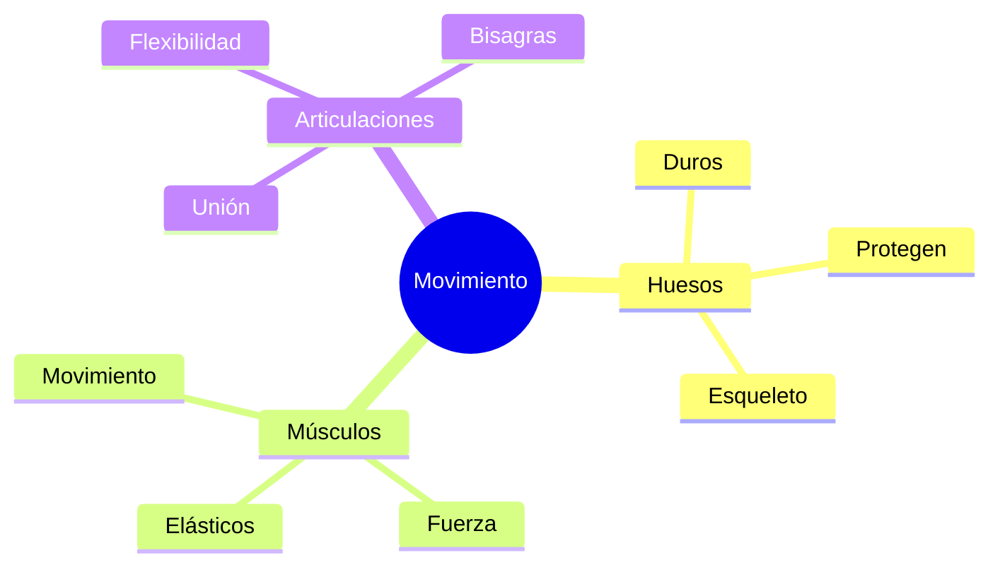

Nuestro cuerpo es como una **máquina perfecta** que nunca se detiene. ¡Incluso cuando dormimos, sigue trabajando! Nosotros somos los "ingenieros" encargados de cuidarla y darle combustible del bueno.

## El Equipo del Movimiento

Para poder saltar, correr y bailar, necesitamos que tres partes trabajen juntas:

1.  **El Esqueleto**: Son los 206 huesos que tenemos. ¡Son el armazón de nuestro cuerpo! Sin ellos, seríamos como gelatina.
2.  **Los Músculos**: Son como gomas elásticas que tiran de los huesos para que se muevan. Tenemos más de 600 músculos.
3.  **Las Articulaciones**: Son las uniones. Imagina que son las bisagras de una puerta. Las más importantes son el **cuello**, los **hombros**, los **codos**, las **muñecas**, la **cadera**, las **rodillas** y los **tobillos**.

## Los 5 Exploradores: Los Sentidos

Nuestros sentidos son como ventanas que nos dicen qué pasa fuera. ¿Sabes cómo funcionan?

*   **La Vista**: Usamos los ojos. ¡Protege tus ojos de la luz muy fuerte!
*   **El Oído**: Usamos los oídos. ¡No escuches ruidos muy altos!
*   **El Olfato**: Usamos la nariz. Nos avisa de peligros como el humo.
*   **El Gusto**: Usamos la lengua. ¡Diferenciamos dulce, salado, ácido y amargo!
*   **El Tacto**: Usamos toda la piel, pero sobre todo las manos.

:::info ¿Sabías que...?
¡Tu corazón es un músculo que nunca descansa! Es del tamaño de tu puño cerrado y late más rápido cuando corres para llevar energía a todo el cuerpo.
:::

## Hábitos de Superhéroe

Para estar siempre listos para la acción, debemos seguir estas reglas:
*   **Dormir 10 horas**: Para que nuestro cerebro descanse.
*   **Higiene**: Lavarse las manos antes de comer y los dientes después.
*   **Alimentación**: Comer de todo, ¡sobre todo frutas y verduras de los huertos de Extremadura!

:::tip Truco
¿Quieres saber si estás bebiendo suficiente agua? Si tienes sed, ¡ya vas tarde! Bebe agua a menudo aunque no tengas mucha sed.
:::
