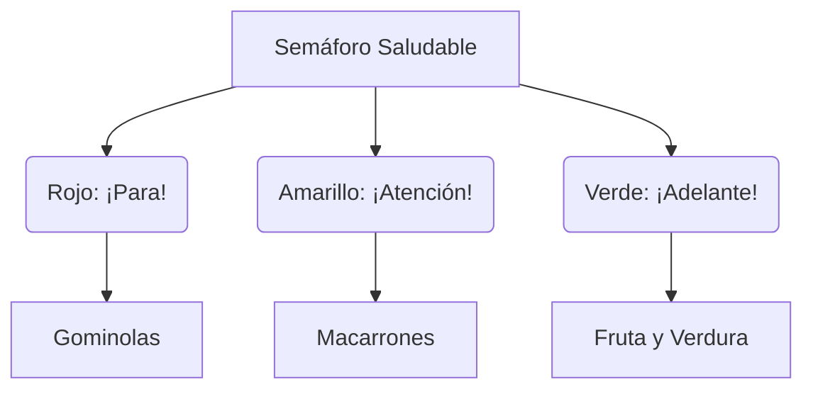

¡Es hora de pasar a la acción! Vamos a convertirnos en detectives para investigar cómo crece nuestro cuerpo y qué necesitamos para estar súper sanos.

## Misión 1: Mi Diario de Crecimiento

Saca tu cinta métrica y pide ayuda a un compañero o a tu profe.

### Paso 1: Tomamos Medidas
*   **Mi altura actual:** ______ cm.
*   **Número de pie (talla):** ______ .

### Paso 2: Comparando Números
¿Quién ha dado el estirón más grande? Compara tu altura con la de un amigo usando los signos **&gt;** (mayor que) o **&lt;** (menor que).

:::info Ejemplo de Investigador
Si Lucía mide 128 cm y Pedro mide 124 cm, escribimos: **128 &gt; 124**.
:::

## Misión 2: El Semáforo de la Comida

Dibuja un semáforo y coloca estos alimentos en el color correcto:

*   **ROJO (Poco):** Caramelos, patatas fritas, refrescos.
*   **AMARILLO (A veces):** Carne, pasta, pan.
*   **VERDE (Mucho):** Manzanas, lechuga, pescado, agua.

## Misión 3: El Ritual de Limpieza

Ordena los pasos para lavarte bien las manos (escribe 1, 2, 3 y 4):
*   ( ) Secarse con la toalla.
*   ( ) Ponerse jabón y frotar.
*   ( ) Mojarse las manos.
*   ( ) Aclarar con mucha agua.

:::tip Truco de Superhéroe
¡Canta tu canción favorita mientras te lavas las manos! Así te asegurarás de que el tiempo es suficiente para espantar a todos los virus.
:::

:::success ¡Misión Cumplida!
¡Has completado tu entrenamiento de Detective de la Salud! Ahora ya sabes cómo cuidar tu cuerpo para que crezca fuerte y sano.
:::
