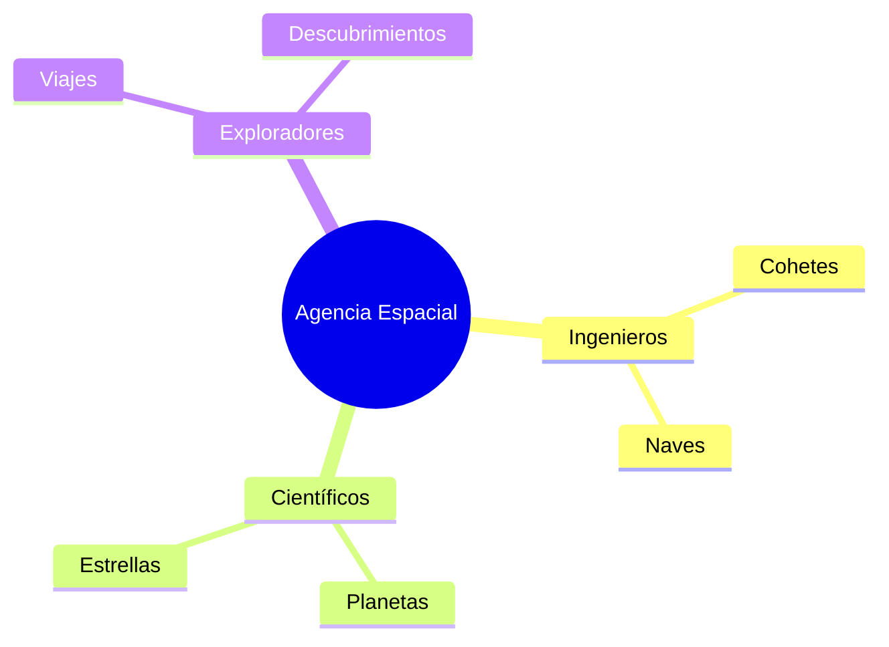

¡Ya eres un astronauta experto! Solo te falta una cosa para poder viajar: ¡tu propio cohete y un mapa de las estrellas!

## Situación de Aprendizaje: La Agencia Espacial de Nuestra Clase

Hoy vamos a trabajar en equipo para colonizar el espacio. ¡Todos tenemos una misión importante!

### ¿Qué necesitamos?
*   Cartulinas oscuras (como el espacio por la noche).
*   Plastilina de colores o pelotas de corcho.
*   Papel de aluminio y purpurina (estrellas).
*   ¡Mucha imaginación espacial!

### Instrucciones para la Misión

1.  **Construye tu Planeta**: Elige uno de los 8 planetas del Sistema Solar. Moldéalo con plastilina intentando que se parezca al de verdad (ejemplo: Saturno con sus anillos de cartón o Marte de color rojo).
2.  **El Mapa Estelar**: En una cartulina negra, pega tu planeta y dibuja estrellas a su alrededor con pintura blanca o purpurina.
3.  **Tu Cohete Personal**: Con un rollo de papel higiénico y un cono de papel, fabrica tu nave. ¡No olvides ponerle papel de aluminio para que brille!
4.  **Bitácora de Viaje**: Escribe en un papelito: *"Yo viajo al planeta ________ porque allí ________"*.

## El Despegue Final

Pondremos todos los planetas juntos en el mural de la clase para formar nuestro propio **Sistema Solar Gigante**. ¡Nuestras naves ya pueden viajar de un planeta a otro!

:::tip ¡Misión cumplida!
¡Enhorabuena, comandante! Has completado tu viaje espacial. Ahora ya sabes que la Tierra es un lugar pequeño y precioso que debemos cuidar entre todos.
:::

**Si pudieras ponerle nombre a una estrella nueva, ¿cómo la llamarías?**
Dibújala en una esquina de tu mapa y ponle su nombre con letras mágicas. ¡Buen viaje!

