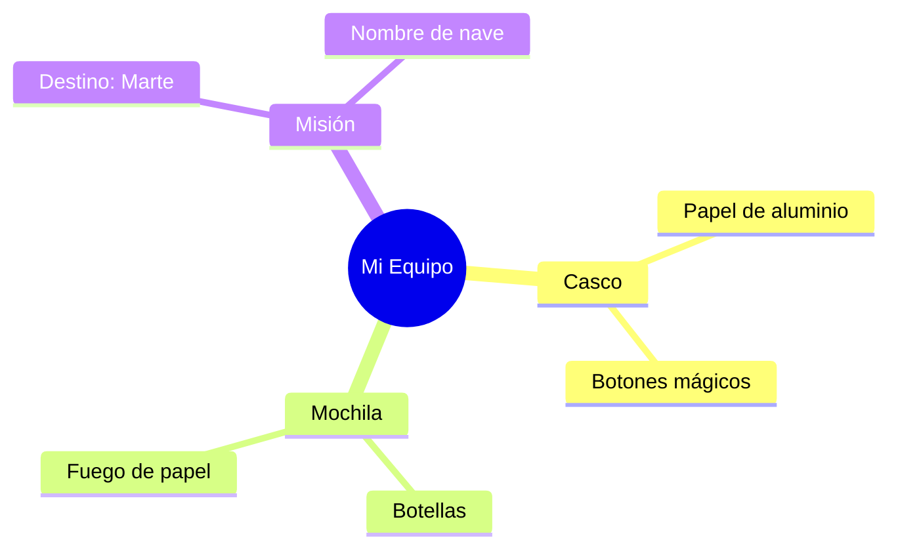

¡Ya eres casi un astronauta experto! Solo te falta una cosa para poder viajar: ¡tu propio equipo de exploración!

## Situación de Aprendizaje: ¡Diseñamos nuestro equipo espacial!

Hoy vamos a usar materiales reciclados para fabricar un casco de astronauta y una mochila de propulsión.

### ¿Qué necesitamos?
*   Una caja de cartón grande (o una bolsa de papel grande).
*   Papel de aluminio (¡para que brille mucho!).
*   Dos botellas de plástico vacías.
*   Cintas o cuerdas.
*   Pintura y pegamento.

### Instrucciones paso a paso

1.  **El Casco**: Pide ayuda para hacer un agujero grande en la caja donde quepa tu cara. Fórralo todo con papel de aluminio.
2.  **La Mochila de Propulsión**: Pega las dos botellas de plástico juntas y píntalas de color plata o fuego.
3.  **Los Mandos**: Dibuja botones de colores en tu casco (uno para la radio, otro para la comida espacial...).
4.  **Tu Misión**: Dale un nombre a tu nave y dinos a qué planeta quieres viajar primero.

:::tip ¡Misión cumplida!
Cuando tengas tu equipo listo, ¡puedes dar un paseo espacial por el patio del cole!
:::

**Pregunta final:**
Si encontraras a un marciano en tu viaje, ¿qué comida típica de Extremadura le regalarías? ¡Seguro que le encanta nuestro jamón o nuestro queso!
