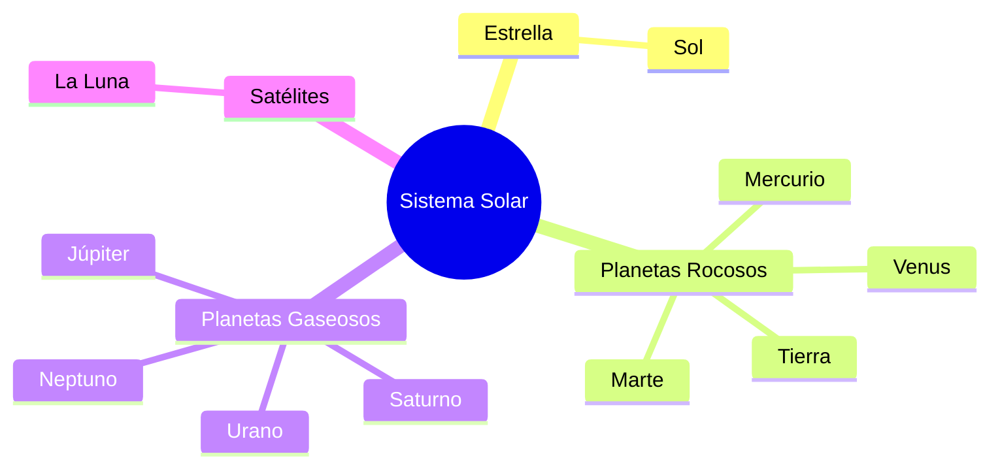

¡Abróchense los cinturones! Nuestra nave espacial despega en 3, 2, 1... ¡Ignición! Hoy vamos a dejar atrás la Tierra para descubrir el **Universo** y nuestro vecindario espacial: el **Sistema Solar**.

## El Sol: El Rey de la Luz

El Sol es una estrella gigante (¡una bola de fuego y gas!). Es tan importante porque:
*   Nos da **luz** para ver durante el día.
*   Nos da **calor** para que no nos congelemos.
*   Mantiene a todos los planetas girando a su alrededor.

## Los 8 Vecinos Espaciales

Los planetas son como hermanos que nunca dejan de dar vueltas al Sol. Se dividen en dos grupos:

1.  **Los Rocosos (Pequeños y duros)**: Mercurio, Venus, Tierra y Marte.
2.  **Los Gaseosos (Gigantes y blandos)**: Júpiter, Saturno, Urano y Neptuno.

## La Tierra y su mejor amiga: La Luna

La **Tierra** es un planeta muy especial porque tiene agua, aire y... ¡a nosotros! Pero no está sola. La **Luna** es su satélite y siempre la acompaña. 

¿Has visto que la Luna cambia de forma? Son sus **fases**:
*   **Luna Llena**: Redonda como una moneda de oro.
*   **Luna Nueva**: No se ve, ¡está escondida!
*   **Cuarto Creciente y Menguante**: Tienen forma de "C" o de "D".

:::info ¿Sabías que...?
En el espacio no se oye nada. ¡Cero ruido! Como no hay aire, el sonido no puede viajar. ¡Es el lugar más silencioso del mundo!
:::

## Las Estrellas y Constelaciones

Por la noche, vemos puntitos de luz. Son soles que están muy, muy lejos. Si unes esos puntos con líneas imaginarias, formas **Constelaciones** (dibujos en el cielo como la Osa Mayor o el Carro).

:::tip Truco de Astronauta
Si quieres encontrar la Estrella Polar, busca el "Carro" en el cielo. ¡Ella siempre te indicará dónde está el Norte!
:::
