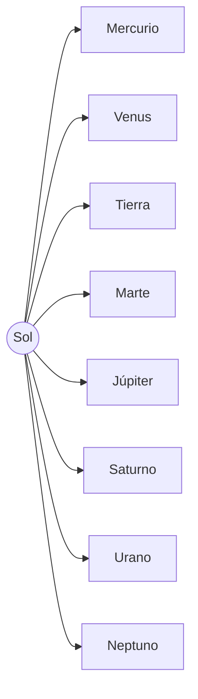

¿Alguna vez has mirado al cielo por la noche? ¡Es enorme! Hoy vamos a subirnos a una nave espacial para conocer el **Universo**.

## El Sol: Nuestra Gran Estrella

El Sol es una bola de fuego gigante que nos da **luz y calor**. Sin él, la Tierra sería un lugar oscuro y muy frío. ¡Es el jefe del Sistema Solar!

## Los Planetas Vecinos

Hay 8 planetas que giran alrededor del Sol. Algunos son pequeños y de roca, y otros son gigantes y de gas:

*   **Mercurio**: El más cercano al Sol. ¡Mucho calor!
*   **Venus**: Brilla mucho en el cielo.
*   **Tierra**: ¡Nuestro hogar! El único con agua y vida.
*   **Marte**: El planeta rojo.
*   **Júpiter**: El más grande de todos.
*   **Saturno**: ¡El de los anillos preciosos!
*   **Urano y Neptuno**: Los más lejanos y fríos.

## La Luna: Nuestra Compañera

La Luna no es un planeta, es un **satélite** que gira alrededor de la Tierra. A veces la vemos redonda (Luna llena) y otras veces parece una uñita.

:::info ¿Sabías que...?
Los astronautas tienen que llevar trajes especiales porque en el espacio no hay aire para respirar.
:::

:::tip Truco
Para recordar el orden de los planetas, puedes inventar una frase divertida con la primera letra de cada uno.
:::
