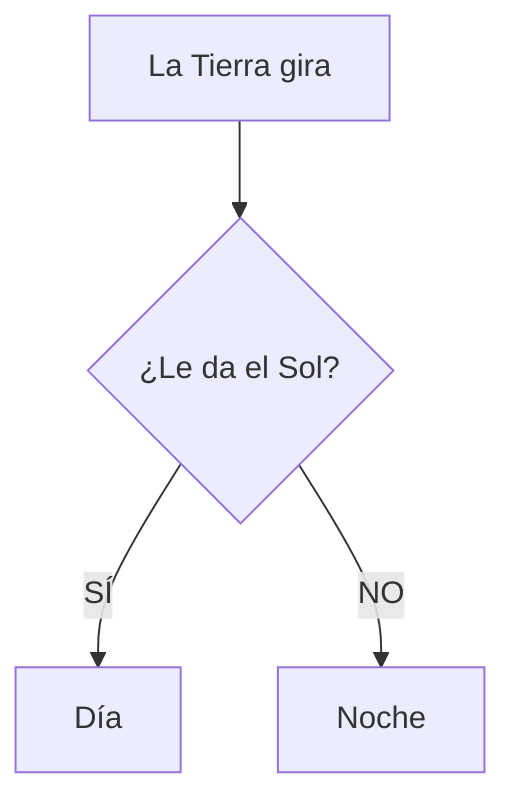

¡Es hora de entrenar para ser astronautas! Vamos a usar los números para navegar por las estrellas.

## Misión 1: Series Espaciales

Nuestra nave necesita un código para despegar. Completa estas series de números:

*   **De 2 en 2**: 2 - 4 - 6 - ____ - ____ - ____
*   **De 5 en 5**: 5 - 10 - 15 - ____ - ____ - ____
*   **Hacia atrás (Cuenta atrás)**: 10 - 9 - 8 - ____ - ____ - ____ - **¡IGNICIÓN!**

## Misión 2: Los Números del 100 al 200

¡Hemos llegado muy lejos! Ahora los números tienen **3 cifras**:

*   **100**: Cien.
*   **110**: Ciento diez.
*   **125**: Ciento veinticinco.

**Escribe cómo se llaman estos números:**
*   140: ________________________
*   162: ________________________
*   199: ________________________

:::info Ayuda
La primera cifra (el 1) se lee siempre como "Ciento...".
:::

## Misión 3: El Día y la Noche

La Tierra nunca para de girar. ¿Qué haces tú en cada momento?

| Momento | Lo que veo | Lo que hago |
| :--- | :--- | :--- |
| **Día** | El Sol | ________________ |
| **Noche** | La Luna y Estrellas | ________________ |

:::tip Truco
Si miras al cielo y la Luna tiene forma de **D**, está **Creciendo**. Si tiene forma de **C**, está **Decreciendo** (haciéndose pequeña). ¡La Luna es una mentirosilla!
:::
