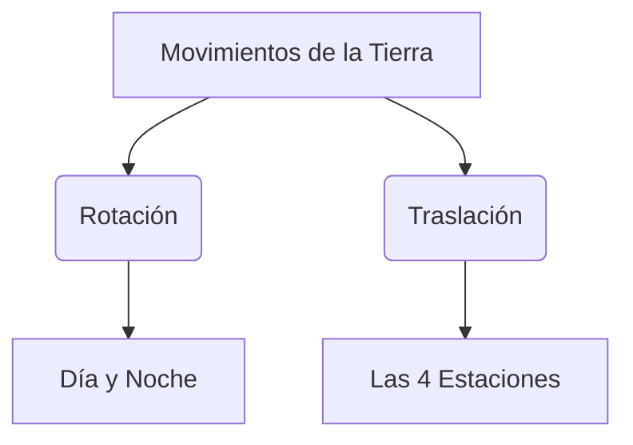

¡Bienvenido al Centro de Entrenamiento Espacial! Para pilotar una nave, un astronauta debe ser muy bueno con los números y conocer bien los secretos del cielo.

## Misión 1: Códigos de Despegue

Toda nave espacial necesita una cuenta atrás perfecta. ¡No podemos fallar!

### Paso 1: Series Numéricas
Completa los huecos para que el ordenador de a bordo funcione:
*   **Hacia adelante (de 10 en 10):** 100 - 110 - 120 - ____ - ____ - ____
*   **Hacia atrás (de 1 en 1):** 10 - 9 - 8 - ____ - ____ - ____ - **¡DESPEGUE!**

### Paso 2: La Centena
En el espacio las distancias son enormes, por eso usamos números de tres cifras.
*   **100** es una **Centena** (10 decenas o 100 unidades).
*   **¿Cómo se llaman estos números?**
    *   135: ________________________________
    *   150: ________________________________
    *   189: ________________________________

:::tip Truco de Centenas
Recuerda: El primer número (1) se lee "Ciento", el segundo son las decenas y el tercero las unidades. ¡Es muy fácil!
:::

## Misión 2: El Baile de la Tierra

La Tierra es una gran bailarina. Hace dos movimientos a la vez:

1.  **Rotación**: Gira sobre sí misma como una peonza. ¡Tarda 24 horas (un día entero)! Esto crea el **Día y la Noche**.
2.  **Traslación**: Gira alrededor del Sol. ¡Tarda 365 días (un año entero)! Esto crea las **Estaciones** (Primavera, Verano, Otoño e Invierno).

## Misión 3: El Mapa Estelar

¿Sabrías identificar a los planetas? Escribe el nombre del planeta que corresponde a cada descripción:
*   Tiene unos anillos espectaculares: **S _ _ _ _ _ O**
*   Es el "Planeta Rojo": **M _ _ _ E**
*   Es nuestro hogar: **T _ _ _ _ A**

:::info Curiosidad Espacial
¿Sabías que en la Luna pesas mucho menos que en la Tierra? ¡Podrías saltar tan alto como una casa!
:::

:::success ¡Entrenamiento Superado!
Has demostrado que tienes mente de astronauta. ¡Tu nave está lista para explorar!
:::
