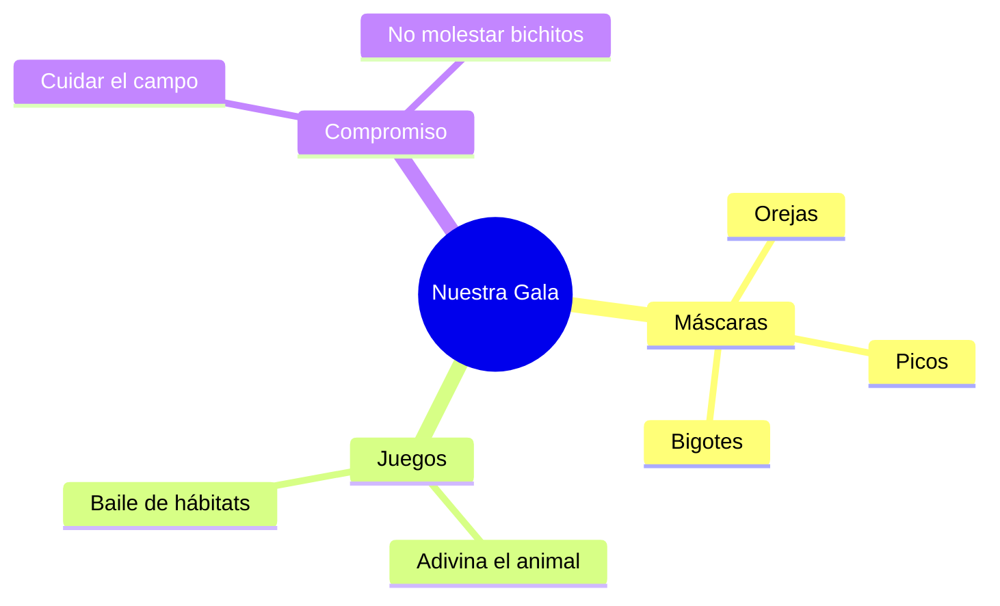

¡Enhorabuena, explorador! Ya eres un experto en el mundo animal. Para celebrar todo lo que hemos aprendido, vamos a organizar la fiesta más salvaje de la historia: **¡La Fiesta del Reino Animal!**

## Situación de Aprendizaje: La Gran Gala de la Selva y la Dehesa

Hoy vamos a representar a nuestros animales favoritos y a explicar a los demás por qué son tan especiales.

### ¿Qué necesitamos?
*   Cartulinas para hacer máscaras o diademas.
*   Maquillaje de cara (si el maestro nos ayuda).
*   Música de sonidos de la naturaleza.
*   ¡Muchas ganas de rugir, piar o ladrar!

### Instrucciones para la Gala

1.  **Crea tu Máscara**: Elige un animal. Dibuja su cara en una cartulina, recórtala y ponle una goma. ¡No olvides las orejas, los bigotes o el pico!
2.  **El Discurso del Animal**: Cada animal saldrá al centro y dirá tres cosas sobre sí mismo sin decir su nombre. 
    *   *Ejemplo: "Soy vivíparo, tengo pelo y me gusta comer bellotas... ¿Quién soy?"* (¡El cerdito!).
3.  **El Baile de los Hábitats**: Cuando suene la música de "agua", los peces y delfines deben moverse. Cuando suene "aire", las aves vuelan. ¡Cuidado no te equivoques de casa!
4.  **Mural Colectivo**: Pegaremos nuestras máscaras en un gran mural que dividiremos en: **AIRE, TIERRA y AGUA**.

## Nuestro Compromiso Verde

Como ahora conocemos mejor a los animales, prometemos:
*   **No molestar** a los bichitos que veamos en el patio.
*   **No tirar basura** al campo para no ensuciar sus hogares.
*   **Respetar** a todas las mascotas.

:::tip ¡Misión cumplida!
¡Ha sido una fiesta increíble! Gracias a ti, ahora todos sabemos que cada animal, por pequeño que sea, es importante para que la Tierra sea un lugar feliz.
:::

**¿Qué animal te ha parecido el más curioso de todos los que hemos visto?**
Dibuja una pequeña huella en tu cuaderno si prometes ser un protector de la naturaleza. ¡Buen trabajo, guardián!

