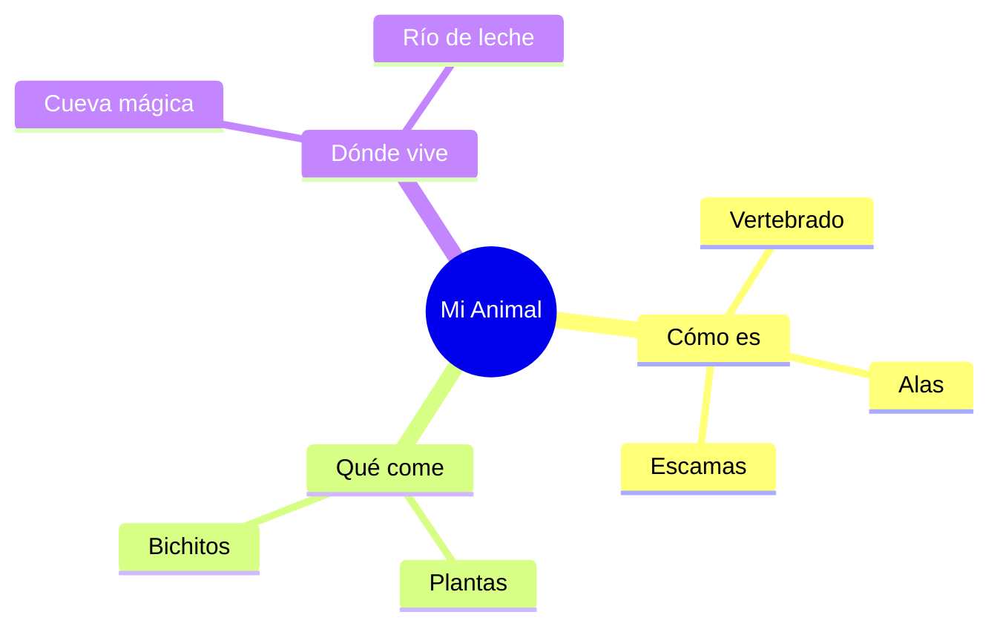

¡Enhorabuena! Ya sabes casi todo sobre los animales. Ahora vamos a usar nuestra imaginación para crear un animal que no existe.

## Situación de Aprendizaje: ¡Inventamos un Animal!

Hoy vas a ser un científico que descubre una especie nueva.

### ¿Qué necesitas?
*   Un folio blanco.
*   Lápices de colores y rotuladores.
*   Pegamento y purpurina (si quieres que brille).

### Instrucciones paso a paso

1.  **Dibuja tu animal**: Mezcla partes de diferentes animales (ejemplo: cuerpo de perro, alas de pájaro y cola de pez).
2.  **Ponle un nombre**: ¡Sé original! (ejemplo: El "Perropájaropez").
3.  **Explica cómo es**: 
    *   ¿Es vertebrado o invertebrado?
    *   ¿Qué come?
    *   ¿Dónde vive?
4.  **Dibuja su casa**: Alrededor del animal, dibuja el paisaje donde vive (el bosque, el mar, el espacio...).

:::tip ¡Misión cumplida!
Cuando todos hayamos terminado, haremos una **Exposición de Animales Fantásticos** en el pasillo del cole.
:::

**Pregunta final:**
¿Qué animal de Extremadura te gustaría ser por un día? ¿Un águila para volar muy alto o un lince para correr por la dehesa? ¡Cuéntanos por qué!
