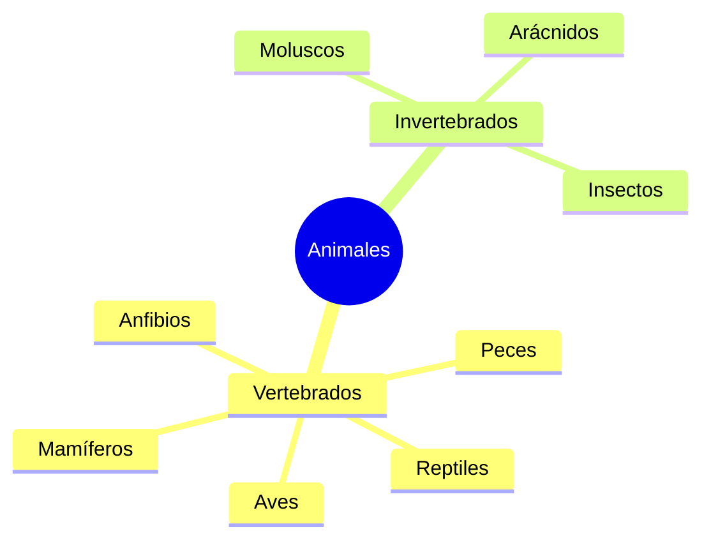

¡El mundo está lleno de seres vivos increíbles! Desde la pequeña hormiga que trabaja en el patio hasta el águila que vuela sobre nuestras dehesas, todos los animales tienen una misión importante en la naturaleza.

## ¿Tienen huesos o no?

La primera forma de clasificar a los animales es mirando su "armadura" interna:

*   **Vertebrados**: Tienen un esqueleto interno con columna vertebral (como tú). Son los **Mamíferos, Aves, Peces, Reptiles y Anfibios**.
*   **Invertebrados**: No tienen huesos. Algunos tienen una concha (caracol) o un caparazón duro (escarabajo), ¡y otros son blanditos como las medusas!

## ¿Cómo nacen y qué comen?

Cada animal tiene su propia forma de llegar al mundo y de alimentarse:

### Según su nacimiento:
*   **Vivíparos**: Nacen del vientre de su mamá (como los perros o los humanos).
*   **Ovíparos**: Nacen de un huevo (como las gallinas o los cocodrilos).

### Según su comida:
*   **Herbívoros**: Comen plantas, frutas y semillas.
*   **Carnívoros**: Se alimentan de otros animales.
*   **Omnívoros**: ¡Comen de todo! (como el cerdo o el oso).

## Animales de Extremadura

Nuestra tierra es un paraíso para muchos animales. ¿Has visto alguna vez a estos?

1.  **La Cigüeña Blanca**: Hace sus nidos en lo alto de las iglesias y torres.
2.  **El Lince Ibérico**: Es un gato montés muy especial que vive en los montes de Extremadura. ¡Es un tesoro que debemos cuidar!
3.  **El Buitre Negro**: Una de las aves más grandes que surcan nuestro cielo.

:::info ¿Sabías que...?
¡Los animales se comunican! Los lobos aúllan, los pájaros cantan y las abejas bailan para decirles a sus compañeras dónde hay flores ricas.
:::

:::tip Truco de Observador
Si ves un animal en el campo, ¡no hagas ruido! Si te quedas muy quieto, podrás ver cómo se comporta en su hogar sin asustarlo.
:::
