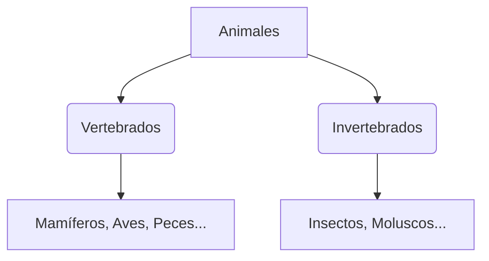

¡El mundo está lleno de seres vivos increíbles! Desde la pequeña hormiga hasta la enorme ballena, todos los animales son especiales.

## ¿Cómo son los animales?

Podemos agrupar a los animales según sus características:

*   **Vertebrados**: Tienen huesos y columna vertebral (como nosotros, los perros o los pájaros).
*   **Invertebrados**: No tienen huesos (como las mariposas, los caracoles o las medusas).

## Las Grandes Familias de Vertebrados

1.  **Mamíferos**: Nacen del vientre de su mamá y beben leche (ej: perro, gato, vaca).
2.  **Aves**: Tienen plumas y nacen de huevos (ej: cigüeña, águila).
3.  **Peces**: Viven en el agua, tienen escamas y aletas (ej: trucha, sardina).
4.  **Reptiles**: Su piel tiene escamas duras y suelen arrastrarse (ej: lagartija, tortuga).
5.  **Anfibios**: Pueden vivir en el agua y en la tierra (ej: rana, sapo).

## ¿Qué comen?

*   **Herbívoros**: Solo comen plantas y hierba (ej: caballo, conejo).
*   **Carnívoros**: Comen carne de otros animales (ej: león, lobo).
*   **Omnívoros**: Comen de todo, plantas y carne (ej: oso, cerdo).

:::info ¿Sabías que...?
En Extremadura vive el **Lince Ibérico**, uno de los animales más bonitos y difíciles de ver del mundo. ¡Tenemos que protegerlo!
:::

:::tip Truco
Si quieres saber si un animal es mamífero, mira si tiene pelo y si sus bebés beben leche. ¡Casi nunca falla!
:::
