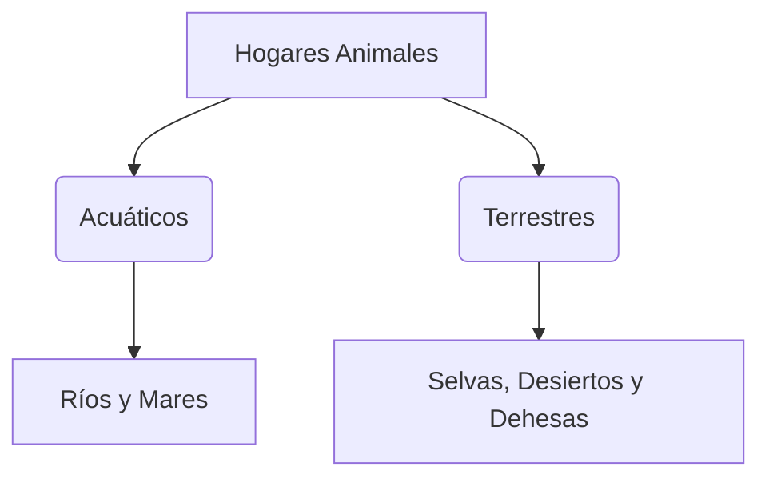

¡Es hora de sacar tu lupa! Vamos a convertirnos en **Naturalistas** (científicos que estudian la naturaleza) y a investigar cómo viven nuestros amigos los animales.

## Misión 1: El Carnet del Animal

Elige a tu animal favorito y rellena esta ficha de investigación:

*   **Nombre del animal:** ________________
*   **¿Es Vertebrado o Invertebrado?:** ________________
*   **¿Cómo nace? (Huevo o Vientre):** ________________
*   **¿Qué tiene en la piel?:** ________________
*   **¿Qué come?:** ________________

:::tip Truco de Naturalista
Si tienes dudas, fíjate en su boca: los carnívoros suelen tener dientes afilados y los herbívoros los tienen más planos para masticar hierba.
:::

## Misión 2: El Laberinto de los Hábitats

¿Sabrías decir dónde vive cada uno? Escribe el tipo de hábitat (Tierra, Agua o Aire):

1.  **Trucha del río Jerte**: ________________
2.  **Cigüeña de la torre**: ________________
3.  **Vaca de la dehesa**: ________________
4.  **Delfín del océano**: ________________

## Misión 3: Cuentas en la Dehesa

En una dehesa de Extremadura, un pastor cuenta sus animales. Ayúdale con estos cálculos:

*   Hay **24 cerditos** comiendo bellotas y llegan **13 más**. ¿Cuántos hay ahora?
    *   Operación: 24 + 13 = ______
*   De un grupo de **48 ovejas**, se van **10** a beber agua. ¿Cuántas se quedan?
    *   Operación: 48 - 10 = ______

:::info ¡Ojo al dato!
Recuerda colocar siempre las unidades debajo de las unidades y las decenas debajo de las decenas. ¡No mezcles las columnas!
:::

## Juego Final: ¡Adivina el animal!

Juega con un compañero. Uno imita el sonido o el movimiento de un animal y el otro debe adivinar de quién se trata. ¡Sin hablar!

:::success ¡Investigación Completada!
Has demostrado que sabes observar y clasificar como un auténtico naturalista. ¡El mundo animal te da las gracias!
:::
