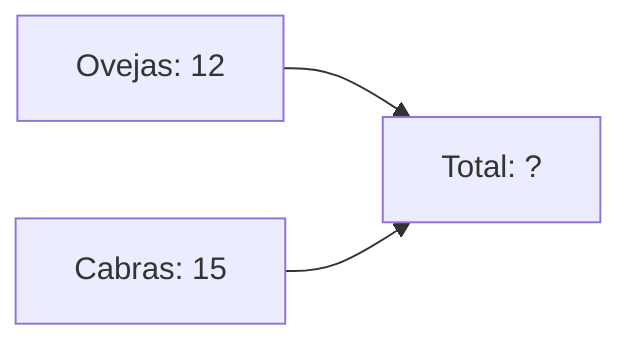

¡Es hora de convertirnos en **exploradores de la naturaleza**! Vamos a investigar cómo viven los animales y qué necesitan para ser felices.

## Misión 1: ¿Quién vive aquí?

Cada animal tiene un hogar especial llamado **hábitat**. Une cada animal con su casa:

*   **Delfín** ----------------> Océano
*   **León** ------------------> ______
*   **Águila** ----------------> ______
*   **Vaca** ------------------> ______

:::info ¿Sabías que...?
Algunos animales, como las cigüeñas, viajan miles de kilómetros cuando llega el frío para buscar un sitio más cálido. ¡Eso se llama **migración**!
:::

## Misión 2: Clasificamos por su piel

Mira estas fotos (o imagina a los animales) y escribe qué tienen en el cuerpo:

1.  **Gato**: Tiene ______
2.  **Pájaro**: Tiene ______
3.  **Pez**: Tiene ______
4.  **Tortuga**: Tiene ______

:::tip Truco
Si quieres saber si un animal es un ave, ¡busca las plumas! Ningún otro animal las tiene.
:::

## Misión 3: Problemas de Granja

En una granja de Extremadura hay **12 ovejas** y **15 cabras**. 

*   ¿Cuántos animales hay en total? 
*   Operación: 12 + 15 = ______
*   Resultado: Hay ______ animales.

:::info Ayuda
Para sumar números grandes, suma primero las unidades y luego las decenas.
:::
