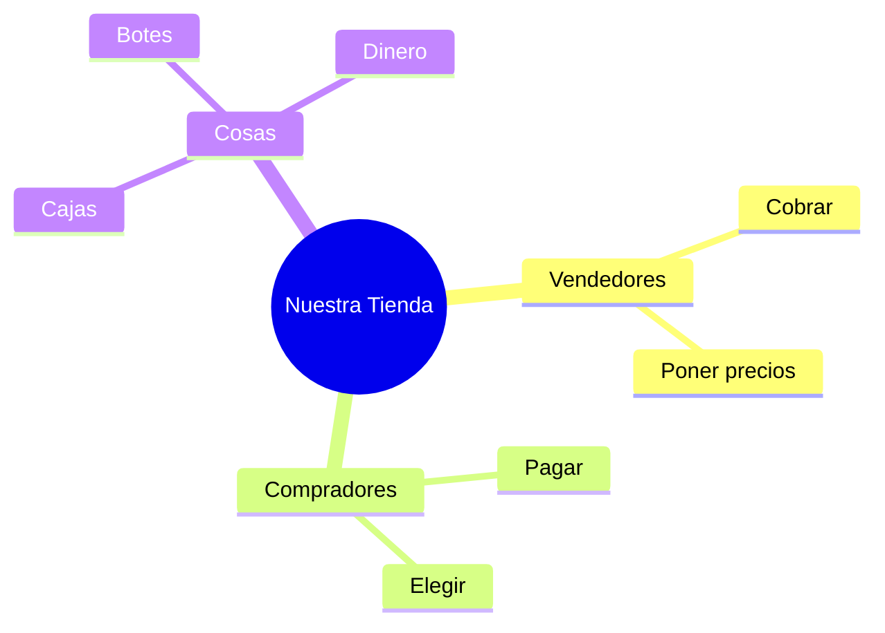

¡Ya eres un experto en el mercado! Ahora vamos a montar nuestra propia tienda en el aula.

## Situación de Aprendizaje: El Mercadillo de 2º

Hoy vamos a jugar por rincones a las tiendas.

### ¿Qué necesitamos?
*   Envases vacíos de casa (cajas de cereales, botellas de leche limpias, botes de yogur...).
*   Dinero de juguete (puedes dibujarlo en papel y recortarlo).
*   Etiquetas para poner los precios.
*   Una caja de zapatos para usar de "Caja Registradora".

### Instrucciones paso a paso

1.  **Montaje**: Coloca los envases en una mesa como si fuera un mostrador.
2.  **Precios**: Ponle una etiqueta a cada cosa (ejemplo: Leche 1€, Galletas 2€).
3.  **Roles**: Unos alumnos serán los **vendedores** (tienen que cobrar y dar el cambio) y otros los **compradores** (tienen una lista y dinero).
4.  **¡A comprar!**: Los compradores eligen qué quieren y pagan en la caja.

:::tip ¡Misión cumplida!
¡No olvides decir siempre "por favor" y "gracias" al comprar! La educación es el mejor pago.
:::

**Pregunta final:**
¿Qué producto de Extremadura pondrías en el escaparate de tu tienda para que todo el mundo lo viera? ¡Dibújalo en un cartel publicitario!
