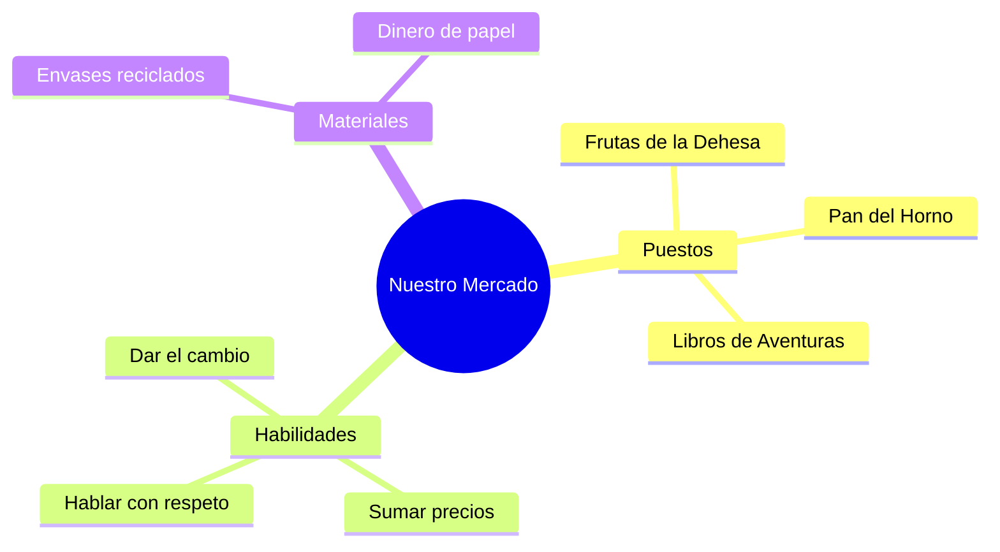

¡Ya eres un experto en el mercado! Ahora vamos a transformar nuestra aula en un **Mercado de Barrio** de verdad. ¡Prepara tu lista y tu monedero!

## Situación de Aprendizaje: ¡Hoy montamos el Mercado!

Vamos a trabajar en equipo para que nuestro mercado sea el mejor de toda Extremadura.

### ¿Qué necesitamos?
*   **Productos**: Envases vacíos traídos de casa (cajas de cereales, botellas de leche limpias, botes de yogur...).
*   **Dinero Mágico**: Monedas y billetes dibujados y recortados por nosotros.
*   **Carteles**: Etiquetas para los precios y un letrero con el nombre de nuestra tienda.
*   **Bolsas de tela**: ¡Para ser compradores ecológicos!

### Instrucciones para la Misión

1.  **Montaje del Puesto**: Dividid la clase en 3 puestos: **Frutería**, **Panadería** y **Librería**. Colocad los productos y ponedles precios (¡intentad que no sean muy caros!).
2.  **Reparto de Roles**: Unos seréis los **Mercaderes** (atender, pesar y cobrar) y otros los **Clientes** (elegir productos y pagar con el dinero exacto).
3.  **La Lista de la Compra**: Cada cliente recibirá una misión (ejemplo: *"Compra una barra de pan y dos manzanas con un billete de 5€"*).
4.  **Cálculo Final**: Al terminar, los mercaderes deben contar cuánto dinero han ganado y los clientes cuánto les ha sobrado.

## El Cliente del Mes

Para ser el mejor cliente, recuerda:
*   **Saludar** al llegar al puesto.
*   **Hacer la cola** con paciencia si hay otros compañeros.
*   **Revisar las vueltas** antes de marcharte.

:::tip ¡Misión cumplida!
¡Enhorabuena, equipo! Habéis demostrado que las matemáticas son muy útiles para la vida real. ¡Mañana cambiaremos los papeles para que todos seáis vendedores!
:::

**¿Qué ha sido lo más difícil de comprar o vender?**
Escribe el nombre de tu tienda favorita y dibuja una moneda de oro si has conseguido comprar todo lo de tu lista. ¡Buen trabajo!

