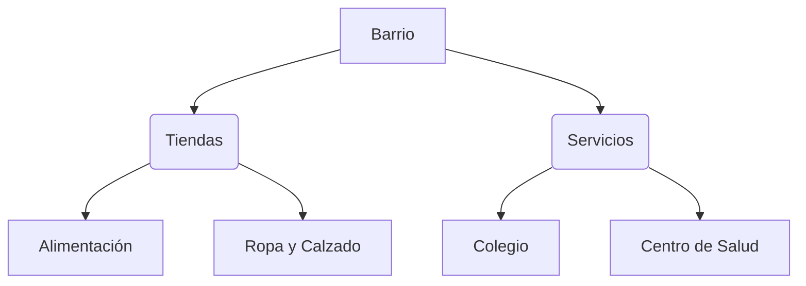

¡Hoy vamos de compras! En nuestro barrio hay muchos sitios donde podemos conseguir lo que necesitamos. ¿Sabes cómo se llaman?

## Los Comercios

En cada tienda venden cosas diferentes:

*   **Panadería**: Para comprar el pan tierno y bollos.
*   **Frutería**: Donde están las manzanas, plátanos y verduras.
*   **Farmacia**: Si necesitamos medicinas para curarnos.
*   **Supermercado**: ¡Donde hay casi de todo!

## ¿Qué es el Dinero?

Para comprar cosas usamos el **dinero**. En España usamos el **Euro (€)**. 

1.  **Monedas**: Son redondas y de metal (1 cent, 10 cent, 1€, 2€...).
2.  **Billetes**: Son de papel y de colores (5€, 10€, 20€...).

:::info ¿Sabías que...?
Antes de que existiera el dinero, la gente intercambiaba cosas (ej: yo te doy huevos y tú me das leche). Eso se llamaba **trueque**.
:::

## Los Servicios Públicos

No todo en el barrio son tiendas. También hay sitios que son para todos:

*   **Parques**: Para jugar con los amigos.
*   **Biblioteca**: Para pedir libros prestados.
*   **Policía y Bomberos**: Para ayudarnos si hay algún problema.

:::tip Truco
Cuando vayas a comprar, lleva siempre una **bolsa de tela**. ¡Así ayudamos a cuidar el planeta usando menos plástico!
:::
