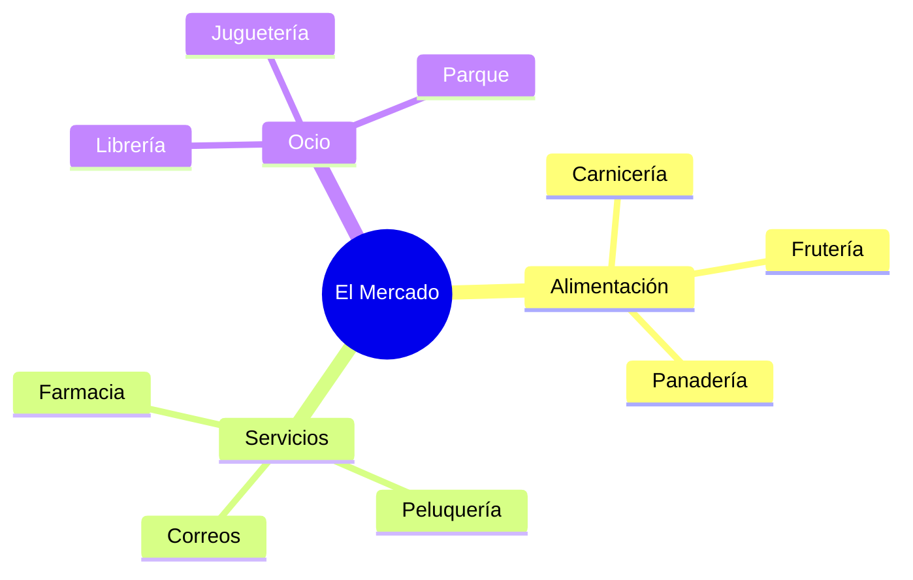

¡Hoy vamos de compras! En nuestro barrio hay muchos sitios mágicos donde podemos conseguir lo que necesitamos. Caminar por sus calles es como leer un libro lleno de letreros y escaparates.

## Las Tiendas de Siempre

¿Sabías que cada tienda tiene un nombre especial según lo que venda? Mira estos ejemplos:

*   **Panadería**: Huele de maravilla a pan recién hecho y tortas de Extremadura.
*   **Frutería**: Un arcoíris de vitaminas con manzanas, peras y cerezas.
*   **Pescadería**: Donde llegan los peces del mar y del río.
*   **Zapatería**: Si necesitamos unas botas nuevas para saltar en los charcos.

## Aprendemos sobre el Dinero

Para poder comprar, necesitamos el **Euro (€)**. El dinero se divide en dos formas:

1.  **Monedas**: Son metálicas y pequeñas. Hay de céntimos (1, 2, 5, 10, 20, 50) y de euros (1€ y 2€).
2.  **Billetes**: Son de papel y de colores según su valor. El más pequeño es el de 5€ (gris) y el siguiente el de 10€ (rojo).

:::info ¿Sabías que...?
En muchos mercados de Extremadura todavía se venden productos que los propios agricultores traen de sus huertos. ¡Son los productos de **proximidad**!
:::

## El Trabajo en el Barrio

En las tiendas trabajan personas que nos ayudan: los **dependientes**. Ellos pesan la fruta, nos dan el cambio y nos atienden con una sonrisa. ¡Es importante darles siempre las gracias!

:::tip Truco del Comprador
Antes de salir de casa, haz una **lista de la compra**. ¡Así no se te olvidará nada y no comprarás cosas que no necesitas!
:::
