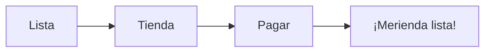

¡Es hora de sacar la cartera (de juguete)! Vamos a ver si sabemos cuánto cuestan las cosas.

## Misión 1: ¡A pagar!

Mira estos precios y dinos qué monedas usarías:

*   **Chupa-chups**: 50 céntimos.
*   **Barra de pan**: 1 Euro.
*   **Libreta**: 3 Euros.

**Suma de la compra:**
Si compro un pan (1€) y una libreta (3€), ¿cuánto me gasto?
Operación: 1 + 3 = ______ Euros.

:::info ¿Sabías que...?
En Extremadura tenemos productos muy famosos como el **Queso de la Serena** o la **Torta del Casar**. ¡Están riquísimos pero cuestan un poquito más!
:::

## Misión 2: Pesamos la fruta

En la frutería, las cosas se pesan en **Kilos (kg)**. 

*   Una sandía pesa: **3 kilos**.
*   Una manzana pesa: **un poquito menos de 1 kilo**.

**¿Qué pesa más?**
*   ¿2 kilos de peras o 5 kilos de patatas? ______
*   ¿1 kilo de plátanos o 1 kilo de fresas? ______ (¡Truco: pesan lo mismo!)

## Misión 3: El Ticket de Compra

Escribe una lista de la compra con 3 cosas que necesites para merendar y ponle un precio (¡puedes inventarlo!):

1.  ________________ -> ______ €
2.  ________________ -> ______ €
3.  ________________ -> ______ €

:::tip Truco
Mira siempre la **fecha de caducidad** de los alimentos. ¡Es muy importante para no ponerse malito!
:::
