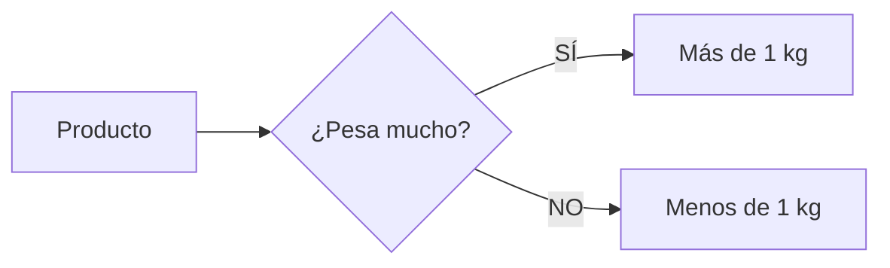

¡Es hora de sacar la calculadora mental! Vamos a ver si somos unos hachas de las finanzas en nuestro mercado de barrio.

## Misión 1: ¡A contar monedas!

Mira estos objetos y dinos cuántas monedas de **1 euro** o de **50 céntimos** necesitas:

*   **Helado de fresa**: 1 € y 50 cts. Necesito 1 moneda de 1€ y ______ de 50 cts.
*   **Cómic de aventuras**: 4 €. Necesito ______ monedas de 1€.
*   **Bolsa de canicas**: 2 € y 50 cts. ¿Cómo podrías pagarlo usando solo monedas de 50 céntimos? (Recuerda que 50 + 50 = 1€).

:::tip Truco de Ahorro
Si juntas dos monedas de 50 céntimos, ¡tienes 1 euro! Y si juntas cinco de 20 céntimos, ¡también tienes 1 euro!
:::

## Misión 2: ¿Cuánto me sobra? (Las Vueltas)

A veces pagamos con un billete más grande y el dependiente nos tiene que devolver dinero. ¡Eso se llama **las vueltas**!

*   **Caso A**: Compras un juguete que cuesta **3 €** y pagas con un billete de **5 €**.
    *   Cálculo: 5 - 3 = ______ €. (Te sobran 2€).
*   **Caso B**: Compras una caja de colores de **6 €** y pagas con un billete de **10 €**.
    *   Cálculo: 10 - 6 = ______ €.

## Misión 3: La Balanza de la Fruta

En el mercado usamos la balanza para saber cuánto pesa lo que compramos. La medida es el **Kilo (kg)**.

**Dinos qué pesa más (>) o menos (<):**
*   Una bolsa de patatas (5 kg) ______ Una red de naranjas (2 kg).
*   Una sandía entera ______ Una manzana pequeña.

:::info ¿Sabías que...?
En las tiendas de antes se usaban pesas de metal. Hoy en día las balanzas son digitales y nos dicen el peso con números brillantes.
:::

:::success ¡Objetivo Conseguido!
Has demostrado que sabes comprar, calcular las vueltas y pesar los alimentos. ¡Ya puedes ir a comprar el pan solo! (¡Con permiso de tus papás!).
:::
