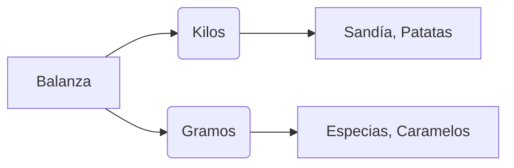

¡Es hora de sacar la calculadora de nuestra mente! Vamos a practicar cómo comprar sin equivocarnos y cómo usar las monedas de euro.

## Misión 1: El Reto de las Vueltas

Estás en la frutería y compras una caja de fresas que cuesta **3 €**. Pagas con un billete de **5 €**. 

*   **¿Cuánto dinero te tienen que devolver?**
*   Operación: 5 - 3 = ______ €.

**¡Tu turno!**
1.  Compras un libro de **12 €** y pagas con un billete de **20 €**: Vueltas = ______ €.
2.  Compras un helado de **2 €** y pagas con una moneda de **2 €**: Vueltas = ______ €.

:::info El Truco del Euro
Recuerda que 1 € son 100 céntimos. ¡Es como una centena de chocolate!
:::

## Misión 2: Pesamos la Compra

En el mercado usamos la **balanza** para saber cuánto pesan las cosas.

**Dinos qué pesa más (&gt;) o menos (&lt;):**
*   Una sandía ______ una cereza.
*   Un saco de patatas ______ una bolsa de pipas.
*   Un litro de leche ______ un paquete de chicles.

## Misión 3: ¿Proximidad o Lejanía?

Dibuja una flecha verde para los productos que vienen de Extremadura (Proximidad) y una roja para los que vienen de muy lejos:
*   Pimentón de la Vera: ______
*   Plátanos de otro país: ______
*   Torta del Casar: ______
*   Aceite de oliva extremeño: ______

:::tip ¡Ojo al dato!
Comprar productos de **proximidad** ayuda a los agricultores de nuestra tierra y contamina menos el planeta. ¡Busca siempre la etiqueta de origen!
:::

:::success ¡Entrenamiento Superado!
¡Ya estás listo para ir al mercado de verdad! Sabes calcular las vueltas, conoces los pesos y eliges los mejores productos para tu salud y para Extremadura.
:::
