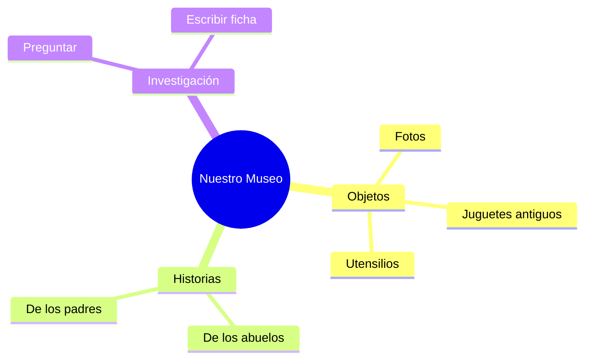

¡Ya eres un historiador experto! Ahora vamos a montar nuestro propio museo en clase.

## Situación de Aprendizaje: El Pequeño Museo de 2º

Hoy vamos a traer un pedacito del pasado al colegio.

### ¿Qué necesitamos?
*   Un objeto antiguo que tengas por casa (con permiso de tus padres o abuelos). Puede ser una foto vieja, un juguete de antes, una moneda antigua, un molinillo de café...
*   Una cartulina pequeña.
*   Un rotulador.

### Instrucciones paso a paso

1.  **Investigación**: Pregunta a tu familia de quién era ese objeto y para qué servía.
2.  **La Ficha del Museo**: En la cartulina, escribe:
    *   **Nombre del objeto**: ________________
    *   **Año (más o menos)**: ________________
    *   **Para qué servía**: ________________
3.  **Exposición**: Ponemos todos los objetos en una mesa con sus fichas.
4.  **Guía del Museo**: Tú serás el guía y explicarás a tus compañeros la historia de tu objeto.

:::tip ¡Misión cumplida!
Los objetos nos ayudan a recordar quiénes somos y de dónde venimos. ¡Cuídalos mucho!
:::

**Pregunta final:**
Si pudieras viajar al futuro, ¿qué crees que habrá en el año 2050? ¿Coches voladores? ¿Robots que hacen los deberes? ¡Dibuja tu invento del futuro!
