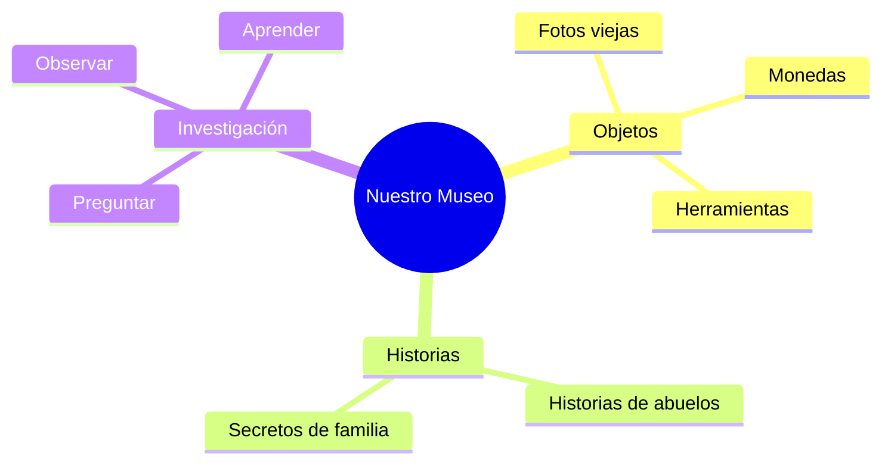

¡Ya eres un historiador experto! Has aprendido a usar la máquina del tiempo y a entrevistar a los mayores. Ahora vamos a montar nuestro propio **Museo de la Historia** en el aula.

## Situación de Aprendizaje: Inauguración de Nuestro Museo

Hoy vamos a traer un pedacito del pasado al colegio para que todos aprendamos de él.

### ¿Qué necesitamos?
*   **Un Objeto del Pasado**: Algo que tengas en casa que sea antiguo (pide permiso a tus padres o abuelos). Puede ser una foto en blanco y negro, un juguete de madera, una moneda vieja, una plancha de carbón...
*   **Ficha de Inventario**: Una cartulina pequeña para explicar qué es.
*   **Tu voz de Guía de Museo**: Para contar historias fascinantes.

### Instrucciones para la Misión

1.  **La Ficha del Tesoro**: En tu cartulina, escribe con letras muy claras:
    *   **Nombre**: ¿Cómo se llama el objeto?
    *   **Dueño**: ¿A quién pertenecía? (ejemplo: "Era de mi bisabuelo").
    *   **Uso**: ¿Para qué servía? ¿Cómo se usaba?
2.  **Montaje de la Sala**: Colocaremos todos los objetos en una mesa grande con sus fichas al lado. ¡Parecerá el Museo de Cáceres o el de Badajoz!
3.  **Visita Guiada**: Por turnos, cada alumno explicará la historia de su objeto. Los demás escucharemos con respeto y podremos hacer preguntas.
4.  **Dibujo del Recuerdo**: Dibuja en tu cuaderno el objeto de un compañero que más te haya sorprendido.

## El Valor de los Recuerdos

Gracias a este museo, hemos descubierto que:
*   **Las cosas duran mucho** si las cuidamos bien.
*   **Nuestros abuelos saben mucho** y tienen historias increíbles.
*   **El pasado es importante** para entender nuestro presente.

:::tip ¡Misión cumplida!
¡Enhorabuena, conservador de museo! Has logrado que el pasado de tu familia siga vivo en nuestra clase. ¡No olvides devolver el objeto a su sitio con mucho cuidado!
:::

**¿Cuál ha sido la historia más sorprendente que has escuchado hoy?**
Escribe el nombre de tu compañero y su objeto. ¡La historia es fascinante!

