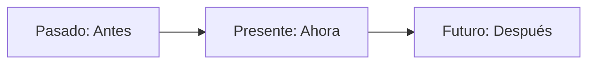
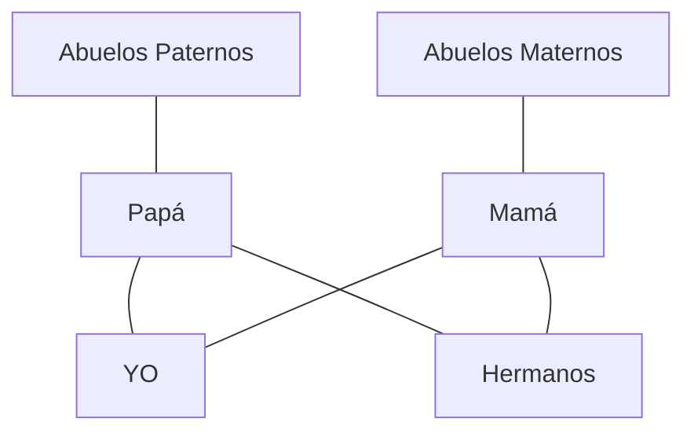

¿Alguna vez te has preguntado cómo era tu calle cuando tus abuelos tenían tu edad? ¡Hoy vamos a subirnos a nuestra **máquina del tiempo** para descubrir que el mundo siempre está cambiando!

## ¿Qué es el Tiempo?

El tiempo es como un río que siempre corre hacia adelante. Se divide en tres momentos:

*   **Pasado**: Lo que ya ocurrió. Puede ser hace un minuto o hace mil años (como cuando los romanos vivían en Mérida).
*   **Presente**: Es el ahora mismo. Estás leyendo esta página.
*   **Futuro**: Lo que todavía no ha pasado. ¿Qué quieres ser de mayor?

## Así cambiamos: El Árbol de la Familia

Todos venimos de una familia que tiene mucha historia. Para no liarnos, usamos el **Árbol Genealógico**. Es como un mapa de nuestros antepasados:

## El Mundo de Nuestros Abuelos

Hace muchos años, la vida en Extremadura era muy diferente a la de ahora:

1.  **En la Cocina**: No había microondas. Se cocinaba con leña o en hornos de piedra. ¡El pan se hacía en casa!
2.  **En la Escuela**: Las pizarras eran de piedra (pizarrines) y no había ordenadores ni tablets.
3.  **En la Calle**: Había muy pocos coches. La gente usaba carros tirados por burros o mulos para ir al campo.

:::info ¿Sabías que...?
En muchos pueblos de nuestra región todavía podemos ver **Dólmenes**. Son monumentos de piedra de hace miles de años. ¡La gente del pasado los usaba para cosas muy importantes!
:::

## Los Recuerdos del Pasado

Podemos conocer la historia de tres formas:
*   **Hablando**: Escuchando las historias de los mayores.
*   **Viendo**: Mirando fotos antiguas o visitando museos.
*   **Leyendo**: Buscando en libros o documentos antiguos.

:::tip Truco de Historiador
Si encuentras una foto antigua, fíjate en la ropa que llevaban. ¡Era muy diferente a la de ahora! Las fotos eran en blanco y negro porque todavía no se habían inventado los colores para las cámaras.
:::
