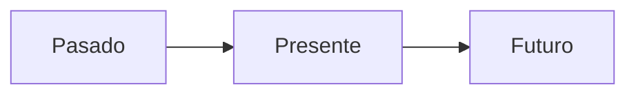

¿Alguna vez te has preguntado cómo era el mundo cuando tus abuelos eran pequeños? ¡Hoy vamos a usar nuestra **máquina del tiempo**!

## El Paso del Tiempo

Todo cambia con el tiempo. Las personas crecemos, los árboles se hacen grandes y las ciudades cambian sus edificios.

*   **Pasado**: Lo que ya pasó (ayer, el año pasado, cuando naciste).
*   **Presente**: Lo que pasa ahora mismo.
*   **Futuro**: Lo que pasará después (mañana, cuando seas mayor).

## Antes y Ahora

Hace muchos años, las cosas eran muy diferentes:

1.  **Transporte**: Antes se usaban carros con caballos, ¡ahora tenemos coches eléctricos y trenes rápidos!
2.  **Comunicación**: No había móviles. La gente se escribía cartas que tardaban días en llegar.
3.  **Juegos**: En lugar de videojuegos, se jugaba al trompo, a las canicas o a la comba en la calle.

:::info ¿Sabías que...?
En Extremadura tenemos muchos **castillos** y **teatros romanos** (como el de Mérida). Son edificios de hace muchísimos años que nos cuentan cómo vivía la gente en el pasado.
:::

## Nuestra Historia Familiar

Cada uno de nosotros tiene una historia. Para conocerla, usamos el **Árbol Genealógico**:

*   **Abuelos**: Los padres de tus padres.
*   **Padres**: ¡Los que te cuidan!
*   **Hermanos y Tú**: La parte más joven del árbol.

:::tip Truco
Si quieres saber algo increíble del pasado, ¡pregunta a tus abuelos! Son como libros de historia con patas.
:::
