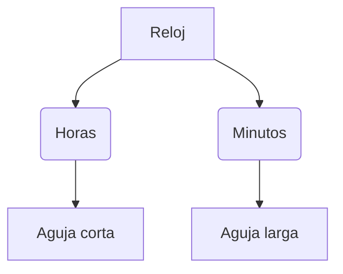

¡Es hora de controlar el reloj! Vamos a aprender cómo se mide el tiempo para no llegar tarde a ninguna aventura.

## Misión 1: El Calendario

Un año tiene **12 meses**. ¿Sabes en qué mes estamos?

*   **Los meses de invierno**: Diciembre, Enero, Febrero.
*   **Los meses de primavera**: Marzo, Abril, Mayo.
*   **Los meses de verano**: Junio, Julio, Agosto.
*   **Los meses de otoño**: Septiembre, Octubre, Noviembre.

**¡Tu turno!** 
*   ¿En qué mes es tu cumpleaños? ____________
*   ¿Qué mes viene después de Mayo? ____________

:::info ¿Sabías que...?
Cada 4 años hay un año "bisiesto" que tiene un día más en Febrero (el día 29). ¡Es un año especial!
:::

## Misión 2: El Reloj

El reloj nos dice las horas y los minutos.

*   La aguja **pequeña** marca las **horas**.
*   La aguja **grande** marca los **minutos**.

**¿Qué hora es?**
*   Aguja pequeña en el 3 y grande en el 12: **Las 3 en punto**.
*   Aguja pequeña en el 6 y grande en el 6: **Las 6 y media**.

## Misión 3: Mi línea del tiempo

Ordena estos momentos de tu vida del 1 al 4:

*   (____) Empecé el colegio de primaria.
*   (____) Nací y era un bebé.
*   (____) Empecé a andar y a decir mis primeras palabras.
*   (____) ¡Hoy estoy en 2º de primaria!

:::tip Truco
Para que no se te olvide nada, apunta las fechas importantes en un calendario de pared en tu habitación.
:::
