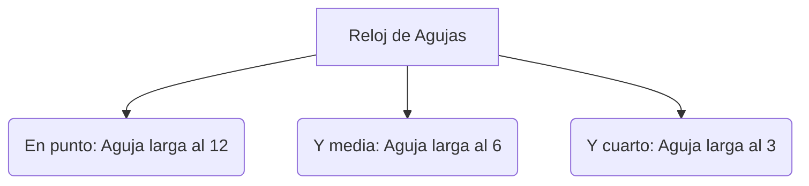

¡Es hora de controlar el reloj! Como guardianes del tiempo, vuestra misión es aprender cómo se mide el paso de los días y las horas.

## Misión 1: El Gran Calendario

Un año es un viaje largo de **12 meses**. ¿Sabes orientarte en él?

### Paso 1: Las Estaciones
Escribe el nombre de los meses que faltan en cada estación:
*   **Primavera**: Marzo, _________, Mayo.
*   **Verano**: Junio, Julio, _________.
*   **Otoño**: Septiembre, _________, Noviembre.
*   **Invierno**: Diciembre, Enero, _________.

### Paso 2: Días Especiales
Dibuja un círculo en el aire (¡o en tu cuaderno!) para estos días:
*   ¿Cuántos días tiene una semana? ______ días.
*   ¿Cuál es el primer día de la semana? ____________.
*   ¿Qué día es hoy? ____________.

:::tip Truco de los Nudillos
¿Quieres saber qué meses tienen 31 días? Cierra el puño y usa tus nudillos. ¡Los meses que caen en "montañita" tienen 31 días!
:::

## Misión 2: El Reloj Mágico

El reloj nos ayuda a organizar nuestro día. Recuerda:
*   La aguja **pequeña** (la lenta) marca las **horas**.
*   La aguja **grande** (la rápida) marca los **minutos**.

**Dibuja en un reloj de papel estas horas:**
1.  La hora de entrar al cole (9:00).
2.  La hora del recreo (11:30).
3.  La hora de salir (14:00).

## Misión 3: Reporteros del Pasado

¡Vas a hacer tu primera entrevista! Busca a una persona mayor (abuelo, abuela o un vecino) y hazle estas 3 preguntas:
1.  ¿A qué jugabas tú cuando tenías 7 años?
2.  ¿Había televisión en tu casa cuando eras pequeño?
3.  ¿Cuál era tu comida favorita de niño?

:::info ¡Ojo de Reportero!
Escucha con mucha atención y anota sus respuestas. ¡Sus recuerdos son tesoros!
:::

:::success ¡Misión Superada!
Ya sabes medir el tiempo y descubrir historias ocultas. ¡Eres un auténtico guardián del pasado!
:::
