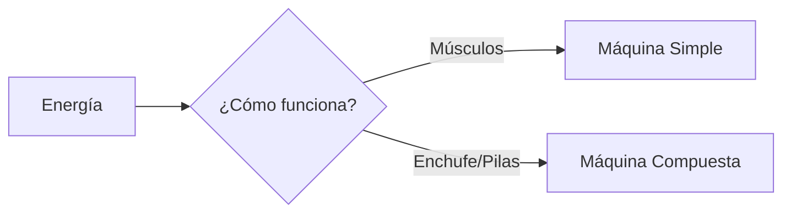

¡Bienvenidos al Taller de Inventos! Aquí vamos a poner a prueba vuestro ingenio para descubrir cómo funcionan las máquinas y cómo podemos usar las matemáticas para repartir piezas.

## Misión 1: La Magia de Repartir (Iniciación a la División)

A veces, para montar un invento, tenemos que repartir las piezas de forma justa. ¡A eso los matemáticos lo llaman **Dividir**!

### El Reto de las Pilas
Tienes **12 pilas** mágicas y quieres poner el mismo número en **2 robots**. ¿Cuántas pilas le tocan a cada uno?
*   Usa tus dedos o dibujos: Pon una pila para el Robot A, otra para el Robot B...
*   Resultado: 12 repartido entre 2 son ______ pilas para cada uno.

### El Reto de las Ruedas
Tienes **8 ruedas** y quieres fabricar **2 coches**. ¿Cuántas ruedas llevará cada coche?
*   Resultado: 8 repartido entre 2 son ______ ruedas.

:::info ¡Truco Matemático!
Repartir es como "deshacer" una multiplicación. Si sabes que 2 x 6 = 12, ¡entonces sabes que 12 repartido entre 2 es 6!
:::

## Misión 2: ¿Máquina Simple o Compuesta?

Mira estos objetos de tu mochila y de tu casa. Escribe una **S** si es Simple o una **C** si es Compuesta:

1.  **Lápiz**: ______
2.  **Sacapuntas**: ______ (¡Cuidado, tiene una cuchilla!)
3.  **Tablet**: ______
4.  **Pinza de la ropa**: ______
5.  **Microondas**: ______

## Misión 3: Seguridad ante todo

Las máquinas nos ayudan, pero algunas pueden ser peligrosas. Une el peligro con el consejo:

*   **Enchufes** ----------------> No tocarlos con las manos mojadas.
*   **Tijeras** -----------------> ______
*   **Cocina de gas** ----------> ______
*   **Herramientas** -----------> ______

:::tip Regla de Oro
Si una máquina hace un ruido extraño o huele a quemado, ¡no la toques! Avisa siempre a un adulto.
:::

:::success ¡Taller Completado!
Has demostrado que sabes usar las máquinas con inteligencia y que eres un hacha repartiendo. ¡El próximo invento del siglo podría ser tuyo!
:::
