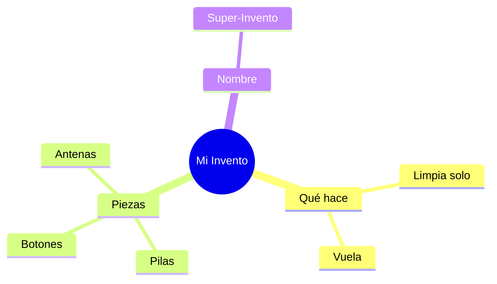

¡Ya sabes mucho sobre máquinas! Ahora te toca a ti ser el inventor.

## Situación de Aprendizaje: ¡El Concurso de Inventos!

Hoy vas a imaginar una máquina que no exista y que sirva para ayudar a alguien.

### ¿Qué necesitas?
*   Un folio.
*   Lápices de colores.
*   ¡Muchas ganas de imaginar!

### Instrucciones paso a paso

1.  **Piensa en un problema**: Por ejemplo: "Me da pereza hacer la cama" o "Mis juguetes siempre están desordenados".
2.  **Dibuja tu solución**: Haz un dibujo de tu invento. Ponle cables, botones, luces... ¡lo que quieras!
3.  **Ponle un nombre**: (ejemplo: "El Camahacedor 3000").
4.  **¿Cómo funciona?**: Escribe una frase explicando qué hace cuando pulsas el botón rojo.

:::tip ¡Misión cumplida!
¡Todos los grandes inventos empezaron siendo un dibujo en un papel! Quién sabe si el tuyo se fabricará algún día.
:::

**Pregunta final:**
¿Qué máquina de tu casa es la que más te gusta? ¿Por qué? ¡Dibuja a tu familia usando esa máquina!
