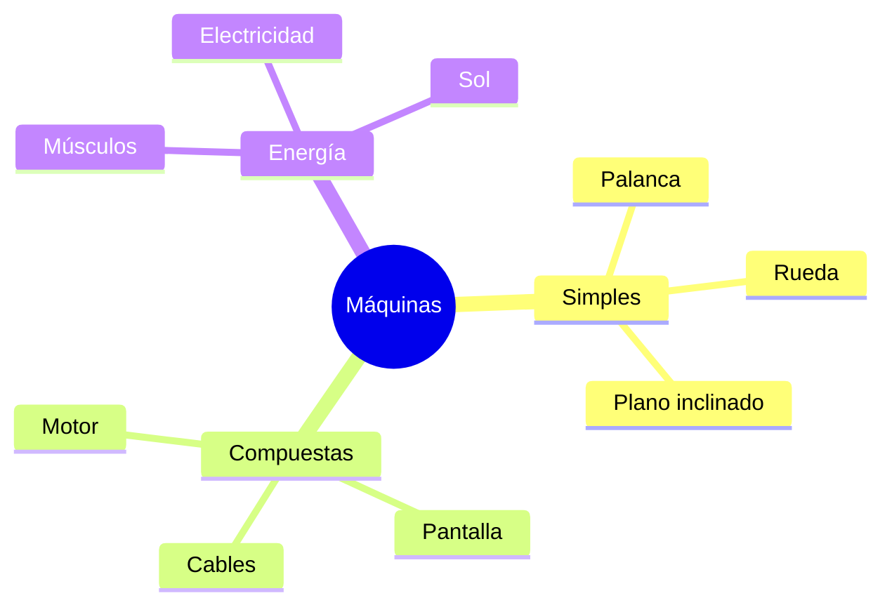

¡El ser humano es un gran inventor! Desde que el mundo es mundo, hemos buscado formas de hacer las cosas más rápido y con menos esfuerzo. A esos objetos que nos ayudan los llamamos **máquinas**.

## ¿Cómo son las máquinas?

No todas las máquinas son complicadas como un robot. Se dividen en dos grandes grupos:

*   **Máquinas Simples**: Tienen una o muy pocas piezas. Funcionan con la fuerza de nuestros músculos. 
    *   *Ejemplos*: La **rampa** (para subir cosas pesadas), la **polea** (para subir cubos de agua) o las **tijeras**.
*   **Máquinas Compuestas**: Están formadas por muchas piezas unidas. Suelen funcionar con electricidad, pilas o gasolina.
    *   *Ejemplos*: La **bicicleta** (aunque usamos los pies, tiene muchas piezas como la cadena y los piñones), el **ordenador** o un **avión**.

## Los Inventos que cambiaron todo

Un invento es algo que no existía antes y que alguien imagina para solucionar un problema.

1.  **La Rueda**: El invento más importante para el transporte. ¡Todo lo que rueda nos ahorra mucho esfuerzo!
2.  **La Imprenta**: Permitió que los libros llegaran a todos los niños del mundo.
3.  **La Bombilla**: Thomas Edison nos regaló luz para poder leer y jugar por la noche.
4.  **El Teléfono**: Para poder hablar con personas que están muy lejos.

:::info ¿Sabías que...?
¡Muchos inventos se inspiran en la naturaleza! Por ejemplo, los aviones imitan el vuelo de los pájaros y el velcro se inventó observando cómo se pegaban algunas semillas a la ropa.
:::

## Máquinas que nos cuidan

Hay máquinas muy especiales que ayudan a las personas: las sillas de ruedas, los audífonos para oír mejor o las gafas. ¡La tecnología está para ayudarnos a todos!

:::tip Truco de Inventor
Si quieres ser inventor, ¡observa bien! Mira si hay algo que sea difícil de hacer y piensa: *"¿Cómo podría hacer una máquina que me ayudara con esto?"*.
:::
