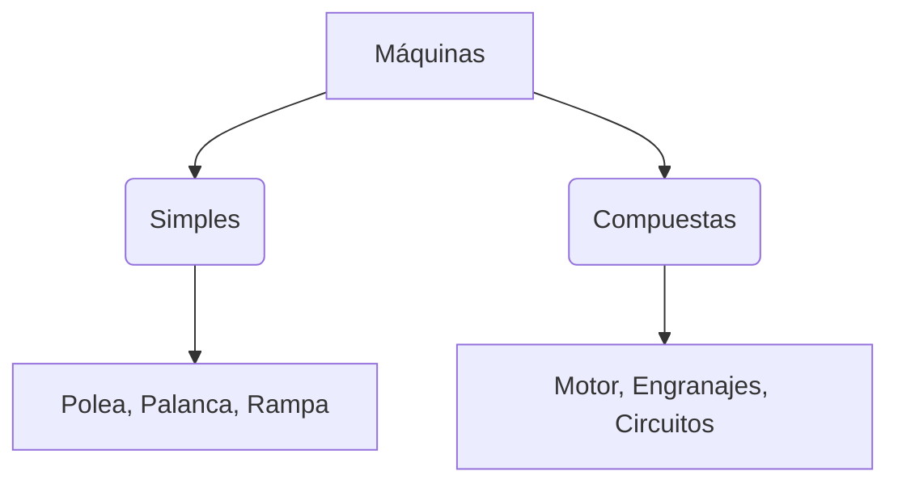

¡El ser humano es muy ingenioso! Desde que vivimos en la Tierra, hemos inventado cosas para ayudarnos a trabajar, viajar y divertirnos.

## ¿Qué es una Máquina?

Una máquina es un objeto que nos ayuda a realizar una tarea con menos esfuerzo. Hay dos tipos:

1.  **Máquinas Simples**: Tienen pocas piezas y funcionan con nuestra fuerza (ej: unas tijeras, un martillo, una polea).
2.  **Máquinas Compuestas**: Tienen muchas piezas y suelen funcionar con electricidad o gasolina (ej: un ordenador, un coche, una lavadora).

## Grandes Inventos de la Historia

Hay algunos inventos que cambiaron el mundo para siempre:

*   **La Rueda**: ¡Imagínate llevar cosas pesadas sin ruedas!
*   **La Imprenta**: Gracias a ella podemos tener muchos libros.
*   **La Bombilla**: ¡Para tener luz por la noche!
*   **Internet**: Para estar conectados con todo el mundo.

## Las Máquinas en Casa

En nuestra casa tenemos muchas máquinas que nos ayudan:
*   **Para limpiar**: La aspiradora o la lavadora.
*   **Para cocinar**: El microondas o la batidora.
*   **Para divertirnos**: La tablet o la consola.

:::info ¿Sabías que...?
Uno de los inventos más importantes fue el **fuego**. Aunque no es una máquina, ayudó a los humanos a calentarse y cocinar hace miles de años.
:::

:::tip Truco
Si una máquina tiene cables o pilas, ¡seguro que es una máquina compuesta!
:::
