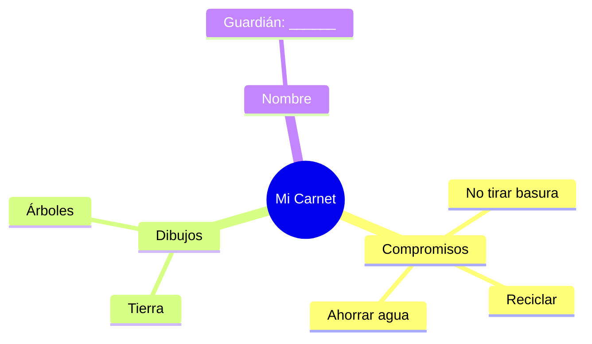

¡Increíble! Has llegado al final del camino. Ahora eres un experto en cuidar el mundo, los animales, las máquinas y la historia.

## Situación de Aprendizaje: La Patrulla Ecológica

Para terminar el curso, vamos a fabricar nuestro carnet oficial de Guardianes del Planeta.

### ¿Qué necesitamos?
*   Un trozo pequeño de cartulina.
*   Tu foto o un dibujo de tu cara.
*   Rotuladores.

### Instrucciones paso a paso

1.  **Diseño**: En un lado del carnet, pon tu nombre y el título "Guardián de la Naturaleza".
2.  **Mi Compromiso**: En el otro lado, escribe 3 cosas que vas a hacer siempre para ayudar (ej: "No tirar basura", "Reciclar el papel", "Cuidar las plantas").
3.  **Decoración**: Dibuja una Tierra feliz o una hoja verde para que quede muy bonito.
4.  **Juramento**: Lee tus compromisos delante de tus compañeros.

:::tip ¡Misión cumplida!
¡Enhorabuena! Has completado todas las unidades de 2º de Primaria. Eres un alumno/a excelente y el planeta te da las gracias por cuidarlo tan bien.
:::

**Pregunta final:**
¿Qué es lo que más te ha gustado aprender en este curso? ¡Dibújalo y enséñaselo a tu familia! ¡Felices vacaciones!
