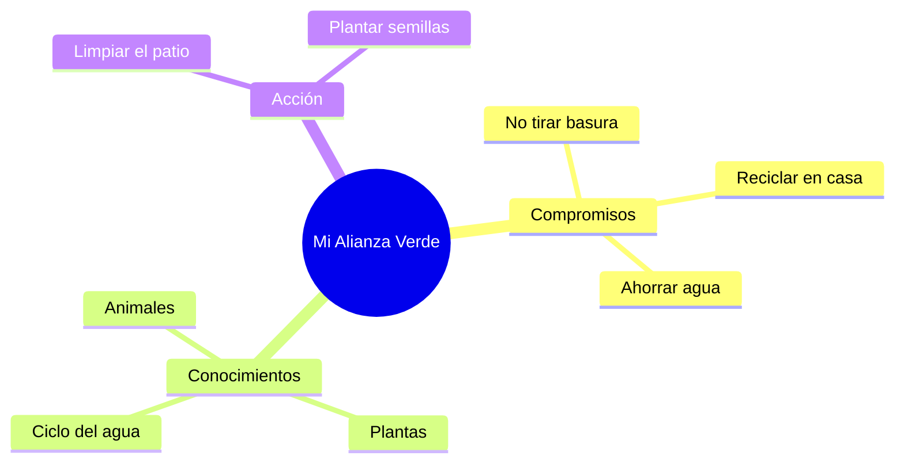

¡Increíble! Has llegado al final de tu aventura en 2º de Primaria. Ahora eres un experto en el colegio, el otoño, el cuerpo humano, el espacio, los animales, el mercado, la historia y las máquinas. ¡Pero sobre todo, eres un **Guardián de la Tierra**!

## Situación de Aprendizaje: La Gran Alianza Verde

Para celebrar que hemos terminado, vamos a fabricar nuestro carnet oficial y a hacer una promesa al planeta.

### ¿Qué necesitamos?
*   Cartulina blanca o reciclada (puedes usar un trozo de una caja de cereales limpia).
*   Una foto tuya o un dibujo de tu cara de "héroe/heroína".
*   Rotuladores verdes y azules.
*   ¡Tu huella dactilar!

### Instrucciones para la Misión Final

1.  **Diseño del Carnet**: En una cara del carnet, pon tu nombre y el título: **"GUARDIÁN/A DE LA TIERRA - CURSO 2º"**.
2.  **Mis 3 Súper Promesas**: En la otra cara, escribe tres cosas que prometes hacer siempre. 
    *   *Ejemplo: "Yo prometo apagar las luces, reciclar los botes y cuidar los árboles"*.
3.  **La Firma de Honor**: Pon un poco de pintura o rotulador en tu dedo índice y plasma tu huella al lado de tu nombre. ¡Es tu firma secreta!
4.  **Juramento del Guardián**: Nos pondremos todos en círculo en el patio y leeremos nuestras promesas en voz alta.

## Mensaje Final de la Tierra

Como ahora eres un Guardián, la Tierra te da las gracias. Has aprendido que:
*   **Todo está conectado**: Si cuidamos las plantas, las abejas tienen comida y nosotros tenemos aire.
*   **Tú eres importante**: Tus pequeñas acciones (como apagar un grifo) ayudan a todo el mundo.

:::tip ¡MISIÓN CUMPLIDA!
¡Enhorabuena! Has completado todas las unidades de 2º de Primaria. Eres un alumno/a excelente y estamos muy orgullosos de todo lo que has trabajado. ¡Felices vacaciones y sigue cuidando el mundo!
:::

**¿Qué es lo que más te ha gustado de este viaje por 2º?**
Escribe una palabra en tu carnet que lo resuma: **¡AMIGOS, APRENDER, NATURALEZA!**

