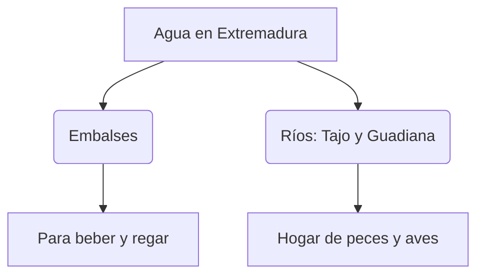
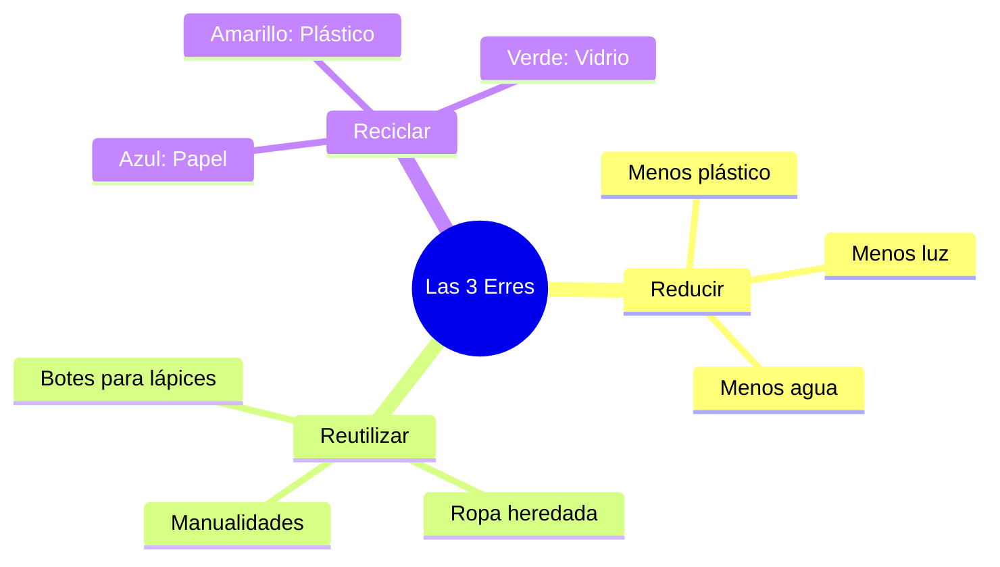

¡La Tierra es nuestro único hogar y nos necesita! Como niños y niñas de Extremadura, tenemos la misión de cuidar nuestros campos, nuestros ríos y a todos los seres vivos que comparten el mundo con nosotros.

## El Tesoro Líquido: El Agua

El agua es vida. Sin ella, no habría plantas, ni animales, ni personas. Pero el agua dulce es escasa, por eso debemos ser **Ahorradores de Agua**:

*   **En casa**: Cierra el grifo mientras te cepillas los dientes.
*   **En la ducha**: ¡Dúchate rápido! No hace falta estar horas bajo el agua.
*   **En el campo**: No ensucies los ríos ni las charcas donde beben los animales.

## El Código Secreto de las 3R

¿Quieres ser un superhéroe de la naturaleza? Solo tienes que seguir este código:

1.  **Reducir**: Es lo más importante. ¡Compra solo lo que necesites! Si usas menos bolsas de plástico, la Tierra estará más contenta.
2.  **Reutilizar**: Antes de tirar algo a la basura, piensa: *"¿Puedo hacer algo divertido con esto?"*. ¡Una caja de zapatos puede ser un cohete!
3.  **Reciclar**: Cuando algo ya no sirve para nada, llévalo a su contenedor mágico.

## Cuidamos Extremadura

Nuestra región tiene sitios increíbles como el **Valle del Jerte** o las **Villuercas**. Cuando los visitemos, debemos recordar:
*   **No arrancar flores**: Son la comida de las abejas y las mariposas.
*   **No hacer fuego**: Para evitar incendios que quemen los árboles.
*   **Caminar por los senderos**: Para no pisar los nidos de los pajaritos.

:::info ¿Sabías que...?
Las plantas fabrican el oxígeno que respiramos. ¡Son como las fábricas de aire limpio del planeta! Cuantos más árboles plantemos, mejor respiraremos todos.
:::

:::tip Misión Diaria
Cada vez que veas una luz encendida en una habitación donde no hay nadie, ¡apágala! Estarás salvando energía y cuidando el futuro.
:::
