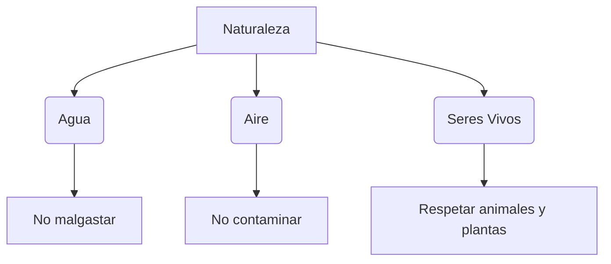

¡Nuestro planeta es nuestro hogar y tenemos que cuidarlo! La Tierra nos da aire para respirar, agua para beber y comida para crecer. ¿Sabes cómo podemos ayudarle?

## Los Tesoros de Extremadura

En nuestra comunidad tenemos paisajes maravillosos que debemos proteger:

*   **Parque Nacional de Monfragüe**: Un sitio lleno de buitres y cigüeñas negras.
*   **Valles y Ríos**: Como el río Guadiana o el río Tajo.
*   **La Dehesa**: El hogar de muchos animales.

## La Regla de las 3 ERRES

Para ser un guardián de la naturaleza, recuerda estas tres palabras:

1.  **Reducir**: Usar menos cosas (ej: apagar la luz si no la usas).
2.  **Reutilizar**: Volver a usar las cosas antes de tirarlas (ej: usar un bote de cristal para guardar lápices).
3.  **Reciclar**: Poner cada residuo en su contenedor.

## ¿Dónde va cada cosa?

*   **Contenedor Azul**: Papel y cartón.
*   **Contenedor Amarillo**: Envases de plástico, latas y briks.
*   **Contenedor Verde**: Vidrio (botellas, botes).
*   **Contenedor Marrón**: Restos de comida (orgánico).

:::info ¿Sabías que...?
Si reciclamos papel, ¡evitamos que se corten muchos árboles! Cada árbol que salvamos nos ayuda a tener aire más limpio.
:::

:::tip Truco
Cuando vayas de excursión, ¡deja el campo mejor de como lo encontraste! Recoge siempre tu basura.
:::
