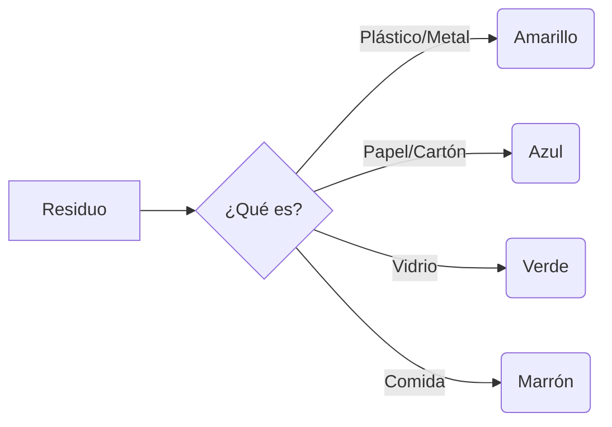

¡Es la última misión del curso, Patrulla! Vamos a demostrar que somos auténticos **Héroes de la Naturaleza** y que sabemos cuidar de nuestro planeta.

## Misión 1: El Código de Colores

Para reciclar bien, hay que conocer los "contenedores mágicos". Une cada residuo con su color:

*   **Caja de galletas y periódicos** --------> Contenedor **AZUL**.
*   **Botella de agua y lata de zumo** --------> Contenedor **AMARILLO**.
*   **Frasco de colonia y bote de potito** --------> Contenedor **VERDE**.
*   **Restos de manzana y cáscara de huevo** --------> Contenedor **MARRÓN**.

:::info ¿Sabías que...?
Las pilas y los móviles viejos no van a estos contenedores. ¡Tienen venenos para la Tierra! Hay que llevarlos al **Punto Limpio** de tu pueblo o ciudad.
:::

## Misión 2: Cuentas por el Planeta

En nuestro colegio hemos organizado una recogida de botellas de plástico para reciclar.

*   El lunes recogimos **45 botellas**.
*   El martes recogimos **32 botellas**.

**¿Cuántas hemos salvado en total?**
*   Operación: 45 + 32 = ______ botellas.

**Si luego usamos 10 botellas para hacer macetas reutilizadas...**
*   ¿Cuántas nos quedan para reciclar?
*   Operación: ______ - 10 = ______ botellas.

:::tip Truco de Ahorro
Cierra el grifo mientras te enjabonas las manos. ¡Puedes ahorrar hasta 10 litros de agua cada vez! Eso son muchas botellas llenas.
:::

## Misión 3: Detective de la Naturaleza

Observa tu patio o un parque cercano. ¿Qué cosas NO deberían estar allí?
1.  ________________
2.  ________________

**Dibuja un cartel pequeño que diga: *"¡No tires ______ al suelo! El planeta es tu casa"*.**

:::success ¡Entrenamiento Terminado!
Has demostrado que tienes ojos de detective y corazón de guardián. ¡La Tierra está un poco más segura gracias a ti!
:::
