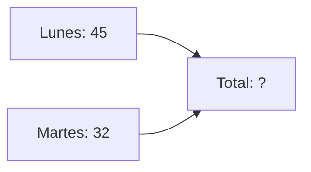

¡Es la última misión del curso! Vamos a demostrar que somos auténticos **Guardianes del Planeta**.

## Misión 1: ¡Al contenedor correcto!

Dibuja una línea (o escribe el color) para llevar cada objeto a su contenedor:

*   **Caja de cereales** --------> Contenedor ______
*   **Bote de mermelada** -------> Contenedor ______
*   **Lata de refresco** --------> Contenedor ______
*   **Periódico viejo** ---------> Contenedor ______

:::info ¿Sabías que...?
Las pilas y los móviles no van a los contenedores de la calle. ¡Hay que llevarlos a los **Puntos Limpios**!
:::

## Misión 2: Problemas de Reciclaje

En el colegio hemos recogido **45 botellas** de plástico el lunes y **32 botellas** el martes.

*   ¿Cuántas botellas hemos recogido en total?
*   Operación: 45 + 32 = ______
*   Resultado: Hemos salvado al planeta de ______ botellas.

## Misión 3: Nuestro Mensaje

Escribe una frase corta para convencer a todo el mundo de que cuide la naturaleza.
Ejemplo: *"¡Cuida la Tierra, es nuestra única casa!"*

:::tip Truco
Cierra el grifo mientras te cepillas los dientes. ¡Puedes ahorrar mucha agua cada día!
:::
